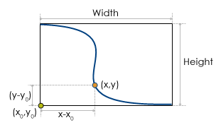
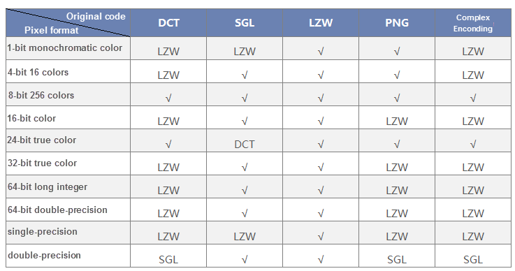

Setting proper encoding modes for GIS data using in different applications is very important to improve the efficiency of the system and saving storage space.

Encoding|Description
---|---  
None|No encoding mode is employed.  
SGL|The SGL (SuperMap Grid LZW) is defined by SuperMap. The SGL is the modified encoding mode based on LZW. The SGL is more efficiently than the LZW. As a lossless encoding mode, the SGL is extensively used for the compressed storage of Grid and DEM datasets by SuperMap.  
DCT|The DCT (Discrete Cosine Transform) is a widely used transform in data compression. Providing a balance between high performance and complexity, the DCT has become a most widely used compression encoding mode all over the world. The DCT decorrelates the image data through the discrete cosine transform, representing the information more compactly. The DCT is a lossy encoding mode with high compression ratio and performance. As a lossy encoding mode, DCT is applicable to image datasets because image datasets are seldom used for accurate analysis.  
LZW|The LZW ( Lempel-Ziv-Welch) is a widely used dictionary compression method. The LZW uses a code to represent a string. Therefore, you can compress not only duplicate data, but also non-duplicate data. The LZW is a lossless compression encoding mode applicable to raster and image datasets.
PNG|The PNG is a lossless compression encoding mode applicable to image datasets.  
JPEG|JPEG is a lossy mode of operation, in the case of no difference in visual effects, the compression ratio can reach 1/20 to 1/40, the degree of compression is higher, suitable for the background image as the image data.  
Complex Encoding|Its compression ratio is close to the DCT coding, yet it focuses on solving the problem of distortion of image boundaries caused by DTC.  
Four-byte|4 bytes are used to store a coordinate value. This encoding mode is applicable to vector data, with 2D point, tabular, CAD datasets and 3D vector dataset excluded.  
Three-byte|3 bytes are used to store a coordinate value. This encoding mode is applicable to vector data, with 2D point, tabular, CAD datasets and 3D vector dataset excluded.  
Double-byte|Two bytes are used to store a coordinate value. This encoding mode is applicable to vector data, with 2D point, tabular, CAD datasets and 3D vector dataset excluded.  
Single-byte|A single byte is used to store a coordinate value. This encoding mode is applicable to vector data, with 2D point, tabular, CAD datasets and 3D vector dataset excluded.  

### The encoding types supported by different data formats 

Vector datasets support four kinds of codes: Single-byte, Double-byte, Three-byte and Four-byte, the four codes adopt the same compression code mechanisms but different compression ratio. All of them are lossy.
Raster datasets support four kinds of codes too: DCT, SGL, LZW and Complex encoding. DCT and Complex encoding are lossy.
Point datasets, attribute table datasets and CAD datasets can not compress codes.
Taking the single-byte coding of the line dataset as an example illustrates the mechanism of compression coding. Assuming that the spatial data of the uncompressed line dataset is stored in double-precision, and now compressing and storing it by using a single-byte compression encoding.
  

  
It is a line object from a line dataset in the picture, the compression ration of using the single-byte equals: **ratio = max(Width,Height)/255**. Width and Height are the width and height of its minimum exterior rectangle.

255 is the greatest value the single-byte can express. According to the picture, coordinates of a point (x, y) after compressing in the line are x'=byte[(x-x0)/ratio] y'=byte[(y-y0)/ratio].

Coordinates of a point after compressing are saved in the byte type, and the size of the compressed dataset is 1/8 original size. Converting a dataset from in double precision code to in byte is lossy. For coordinate values, the maximum lossy value is the ratio.

For other vector compression codes, they have the same theory, and the maximum lossy value is: **ratio = max(Width, Height)/maxValue.**

Width and Height are the height and width of the minimum exterior rectangle of the geometry object, maxValue is the maximum value that the code can express. (Single-byte is 255, double-byte is 65535, three-byte is 16777215, and four byte is 4294967295)

* For image and raster datasets, choosing the appropriate compression encoding method based on its pixel format is very beneficial to improve system efficiency and save storage space. The following table lists the reasonable encoding for the different pixel formats of the image and raster datasets. For example, the pixel format is 1-bit monochrome data and supports LZW and PNG. When the original encoding mode is DCT, SGL, or complex encoding, LZW can be selected.
  
  
**Note** : Raster datasets support LZW and SGL, if the original encoding type is DCT or complex code, SGL can be selected. The non-grayness palette of 8-bit images does not support DCT, but can convert to LZW.

