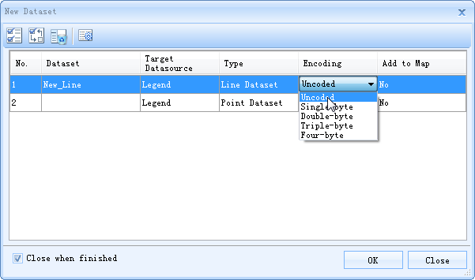
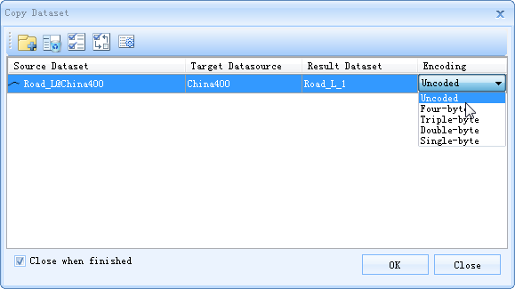
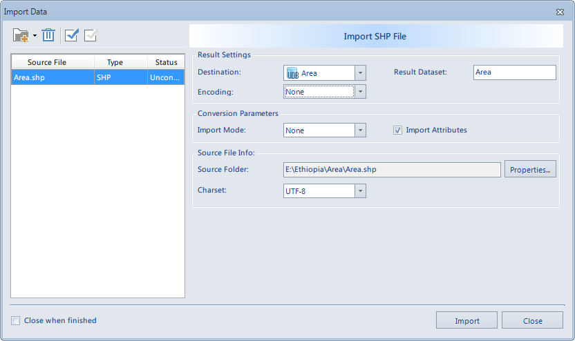
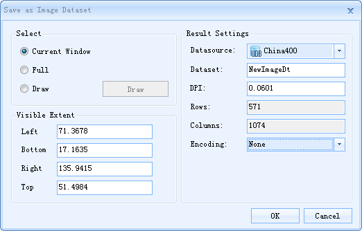

---
id: EncodeUsing
title: Using Dataset Encodings
---  
Dataset Encoding Mode can be modified when creating new dataset, copy dataset, import dataset or export dataset. Right click on a dataset, select "Properties" in the context menu, and view the encoding mode of the dataset in the Properties window that pops up.

### New Dataset

When creating a vector dataset, users can select encoding modes they needed.

  
---  
  
### Copy Dataset

When copy a vector dataset, users can select encoding modes they needed.

  
---  
  
Different types of datasets and the corresponding encoding mode are shown in the table below:

**Table 1: The encoding modes of different types of datasets**  
Dataset Type | Encoding  
Vector dataset | Single-byte, Double-byte, Three-byte and 4 byte  
DEM/Grid dataset | SGL, LZW  
Image Dataset | LZW, DCT, PNG  
  
### Import Dataset

The figure below shows the optional encoding modes when importing external data to SuperMap.

  
---  
  
The default encoding mode of image dataset is DCT, for other datasets, the default encoding mode is Uncoded.

### Save as Image Dataset

Right click in the map window, and select "Save as Image Dataset" form the context menu, the encoding mode can be DCT, LZW, PNG or None, as shown in the figure below:

  
---  

