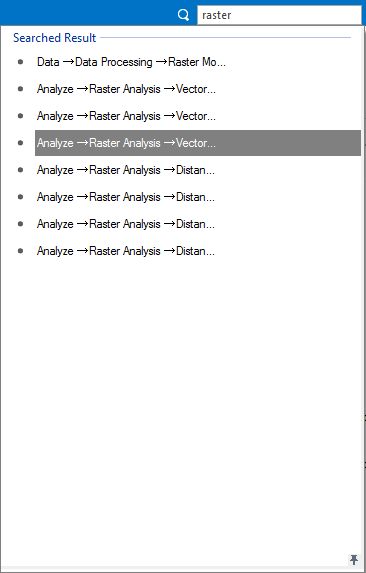

provides rich GIS data processing functions, and provides the "Function Search" tool to search the relevant function by keywords or the function name. "Function Search" is for global searching, the result will be the relevant functions in all of the visible tabs for current workspace, and the result contains tab name, group name and function name. **Note** : it just searches from the currently visible tabs, will not search from the invisible tabs. If not found, it will pop up that the function you search doesn't exist.

### Search by name or keywords

The Function Search tool locates on the right corner of the application. Users can directly input the function name to search; if not knowing the full name of the function, can input the keywords to find all relevant functions. The searching result is as follows:

  
---  
The Searching Result  
  
The searching result is like above. If users have used the functions in the searching result, the functions will also be displayed in the Recent Use group. Click a function in the result list to open relevant dialog, or press Up or Bottom key to select a function, press Enter to open relevant dialog. It also supports inputting texts to locate the function.

**Note** : If it pops up the current item is not available when using a function in the list, it means that the necessary data is not opened to cause the function not be able to be used.

