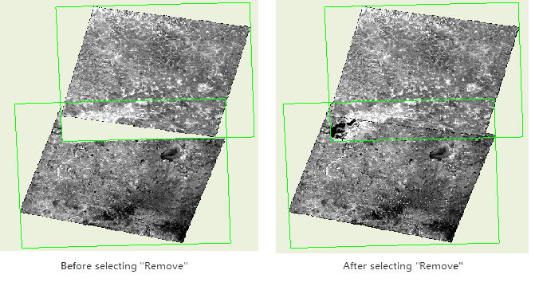

A series of features are provided for manaing mosaic dataset. Below contents details each feature.

### Browse Outline Attributes

Right click your mosaic dataset and then click "Browse Outline Attributes" to open the attribute table which is the attriute table of the outlines actually. Of which, every record matches an outline object. Primary fields of the attribute table:

    * **SmFileName**: The file names (extension excluded) of all original image files managed in the mosaic dataset, as well as the file names of overviews(extension included).
    * **SmPath**: The full path (absolute path) of all original image files that are added to the mosaic dataset and the full path of every overview file. The paths support the network sharing paths. Therefore, you can realize the shared use of the mosaic dataset by editing this field .
    * **SmCategory**: To identify whether the image that is currently displayed within the outline is the original image file or overviews, with 1 indicating the original image file and 2 representing the overviews. 
    * **SmMinPS**: Defines the lowest resolution of the image that can be accessed. The default value is 0. If a request requests images below he specified minimum resolution, the request fails and the images will not be returned. 
    * **SmMaxPS**: Defines the highest resolution of the image that can be accessed. The default value is 0. If a request requests images greater than the specified maximum resolution, the request fails and gray images will be returned. 
    * **SmMinPS** and **SmMaxPS**: SmMinPs and SmMaxPs define the size range of the pixels. The settings determine at which resolution the mosaic image data will display. The system calculates SmMinPs and SmMaxPs values based on the overlay between the image pyramid and the images. 
    * **SmLowPS** and **SmHightPS** define the actual range of pixel size contained in a raster dataset, with SmLowPS indicating the real resolution of the image, and SmHightPS indicating the image pyramid resolution of the image.
  
---  
Figure: Attribute Table  

### Add Mosaic Data

Add .tif, .tiff, .img files into a mosaic dataset to manage. The specific operations are as follows:

  1. Right click your mosaic detaset then click "Add Image Data..." to open the dialog box "Add Mosaic Data" where you can add new images. You can add a single file, or files through importing a folder or a folder list. 
  
---  
Figure: Add Image Data  
  2. Click "OK", and then your image files will be added into the mosaic dataset.
  3. The absolute path of every image file is recorded in the mosaic dataset. A image file will be displayed with the coordinate system of your mosaic dataset without any changes in the original image files.

### Create Image Pyramid

To improve the display effects of a lot of image data, you can create a pyramid for the data. The program will create multiple levels of pyramids as a rule to make the pyramid image with relative resolution display in different scales. When creating overviews, pyramids are needed for all images in your mosaic dataset.

  1. Right click your mosaic dataset, and select "Create Image Pyramid" to open the "Create Image Pyramid" dialog box where you can do some settings of parameters. Following methods are provided for resampling. On detail introductions about the means of resampling, please refer to [the introductions of resampling](../../DataProcessing/Registration/resamplemethod.htm).
    * **Nearest** : Take the most adjacent pixel values of input raster dataset as input values to assign the relative pixels of output raster dataset.
    * **Average** : Resample by calculating the average of all valid values.
    * **Gauss Kernel Calculation** : Resample in the way of Gauss Kernel Calculation. For the kinds of images with high contrast and image boundaries, the resampling way are better.
    * **Average_magphase** Averages complex data in magphase space.
  2. Set the number of threads of creating image pyramids.
  3. Click "OK" to perform the operation.

### Build Overviews

To make the display effect of mosaic dataset better, only outlines will be shown in smaller scales by default.

  1. Right click your mosaic dataset and select "Build Overview", then the dialog box "Build Overview" pops up, where you can set the max width, max height, sample tolerance and output path of Overviews.
  
---  
Figure: Build overviews  
    * **Max Width and Height** : Set the maximum width and height of overviews.
    * **Sample Tolerance** : The resolution ratio between two adjacent levels of overviews.
    * **Output Path** : The storage paths of overview files.
    * **Remove** : Some black boundaries may appear because of the novalue areas overlap the normal area, so when you are creating overviews, you can specify an value for non-value areas to correctly display the overlapped areas.
  
---  
Figure: The comparison image  
    * **Multi-tasking** : Creating overviews by opening multiple processes to improve the creation speed. According to the computer configuration and process usage sets a proper number.
  2. Click "OK" to finalize the operation. Building overviews for mosaic datasets is actually a reconstruction of the multi-layer pyramids according to some rules for the original image. After the overview is built, the mosaic dataset can be shown at a small scale and image files are generated and saved under the overview output path. Related records will be added into the outline attribute table.
  
---  
Figure: The comparison before and after generating overviews.  

### Reassign Path

Respecify the paths of the original image files or the paths of overviews.

  1. Right-click your mosaic dataset, and select "Reassign Path..." to open the "Reassign Image Data" dialog box where you can modify the paths of original files and overviews' paths.
  
---  
Figure: Respecify image data  
    * **The path of original image**: If the original image has been moved, to call it, you only need to reset the path of the image file in here.
    * **The path of overviews**: Update the storage path of overviews.
  2. Click "OK" to finalize the update.

### Empty Data

  1. Right-click your mosaic dataset, and select "Empty Data..." to open the "Empty Data" dialog box. You can remove all records, or only remove overviews from the mosaic dataset.
  2. Click "OK" then related data will be deleted.

### Rebuild Bounds

If some changes happen in your mosaic dataset, you can rebuild the range of your mosaic dataset by clicking the function. For more details, please refer to [Image map configuration - rebuild data range](MosaicDatasetMapConfig.htm#2).

  1. Right click your mosaic dataset, and select "Rebuild Bound", then the "Rebuild Bound" dialog box appears.
  
---  
Figure: Rebuild Bounds  
  2. There are three options are provided for rebuilding bounds in the dialog box: 
    * **Rebuild** : Rebuild the range of boundaries for your mosaic dataset. Two ways are provided including: 
      * **Select Dataset Region** : Choose a region dataset from a datasource to rebuild bounds.
      * **Custom Bounds** : Through drawing bounds and object selection to set up bounds.
    * **Rebuild Footprint** : You are allowed to rebuild footprint bounds by checking it.
    * **Rebuild Clip Bounds** : You are allowed to rebuild clipping bounds by checking it.
  3. Click OK button to perform the operation.

### Statistics Information

Statistics information make preparation for the display of your mosaic dataset in differently stretching ways. Statistics information is essential for you to set a display stretching way in your mosiac dataset.

  1. Right click your mosaic dataset, and select "Statistics Information", then the application will count the maximum value, minimum value, average, standard deviation, variance and so on.
  2. After completing the operation, the prompt "Statistical mosaic data information is complete." will be output in the Output Window. 

### Export Data

  1. Right click your mosaic dataset, and select "Export Data..." to open the "Export Mosaic Data" dialog box. To export a file or a file list, please set following parameters:
    * **Settings Bounds** : Set the bounds of file or file list you want to export. Four ways are supplied for the settings of bounds: Whole (the whole map), Draw Range (draw a range in the map window), Select Object (select one or more objects as the range), and Copy/Paste (an existed coordinate value). The Select Object can be worked unless there is at least one region dataset, and for the Draw Range feature, the mosaic dataset must be opened.
    * **Settings** : Set what kinds of files will be exported: overviews or image data or both of them.
    * **Save Result** : Set the output path of data. 
    * **Save as Dataset** : Export your mosaic dataset as a new dataset and save it into a datasource.
  
---  
Figure: Export Mosaic Data  
  2. Click "OK".

### Update Image File List

When some changes occurs in your mosaic dataset, such as deleting some images, adding some images or paths of original images changed, you can update your mosaic dataset with following features.

  1. **Add mosaic data** : Add new image files into your mosaic dataset.
  2. **Build Overview** : Rebuild overviews.
  3. **Reassign Path** : Modify the paths of original image files or overviews.
  4. **Empty Data** : Delete image file list with keeping overviews or delete all lists to make the mosaic dataset empty.
  5. **Rebuild Bounds** : When adding or deleting some image files, you can click the feature to update the boundaries of your mosaic dataset.

### Related Topics

 [Mosaic dataset overview](MosaicDataset.htm)

 [Mosaic dataset display](MosaicDatasetView.htm)

 [Configure image map based on a mosaic dataset](MosaicDatasetMapConfig.htm)

 [Create a mosaic dataset](CreateMosaicDataset.htm)

  

