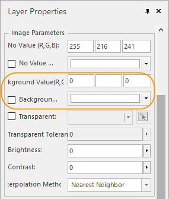

The full extent of your mosaic dataset which contains a huge amount of image data will be shown originally without any contents but the outlines. Until it is zoomed at a scale, the mosaic dataset reads the images within the current display range then joints them together dynamically. The first browse speed may be slow, but the system will create cache to improve the speed for your next browse.

  
---  
Figure: Showing the full extent of mosaic dataset  
  
When you want to view the full extent of your mosaic dataset after jointing images, you can create an overview for it which can make the results show at a small scale. For descriptions of overviews, please consult [Manage Mosaic Dataset](MosaicDatasetManage.htm#5).

  
---  
Figure: Showing the full extent of mosaic dataset (with an overview)  
  
### Remove no-values

Besides, after correcting some remote sensing images, no-value areas appear
which have impact to the display efficiency. The no-value areas may be inside
or outside of valid areas.

  
---  
  
The No-value areas no matter generated by correcting images or existed in the
data self need removing. There are two choices to remove them:

  1. **No Value Transparent** : In the layer manager, select the image layer then open the Layer Properties panel. Specify the no-value as the bands of the image, then check the No Value Transparent.
  
 
  2. **Clip Display Mode** : Take the valid regions as the clip area. When showing your mosaic dataset, the clip area is shown but the no-value area generated by correcting images. 
    * **Determine the clip area** : With the clip dataset specifies the clip area of every image, as follows:    
 
      * After determining all clip areas (we call it clip shape) of all images, each clip shape as a region object is saved in a .shp file whose name is the same with the image name. The .shp file is storaged under the same level directory of the corresonding image.
      * After the .shp file is ready, you need rebuild the clip range for your mosaic dataset. The contents of default clip dataset are rebuilt based on the footprint dataset. The specified clip shape will be update to the clip dataset. Right click the mosaic dataset node and select "Rebuild Bounds..." to open the "Rebuild Bounds" dialog box. In the dialog, check "Rebuild Clip Bound" and specify the clip file(.shp).
  
 
Figure: The overlap between the clip dataset and images after rebuilding the
clip bounds  
    * **Clip the images** : In the Layer Properties panel, check "Draw by file" and specify the Clip Type as Data Clip.
  

Figure: Removes the no-value areas generated by correcting  

###  The settings of display efficiency

The settings of display efficiency for images of mosaic dataset are similar to the settings for common images. The adjustments of displays contains: the special value display, the colortable display, the stretch display, or you can set a grid function to get the 3D Hillshade Map and Ortho image efficiency. All the settings can be done on the Layer Properties panel.

  * **The display of special value** : You can specify the area with a special value transparent or display them with a special color. 
  

Figure: The display settings for the area with a special value  
  * **Colortable display** : You can use the color table to display the elevation grading of DEM data.
  
 
Figure: Colortable display  
  * **Stretch display** : With the feature, images can be shown more clear. And you can combine the Colortable Display to make images more beautiful.
  

Figure: Stretch display  
  * **Grid function display** : When the mosaic dataset manage DEM data especially for large-scale data, with the Grid Function Display feature, you can quickly get the display efficiency of 3D hillshade map and ortho image.
  

Figure: Grid function display  

###  The settings of display bounds

  * Construct a display filter expression to show parts of images in your mosaic dataset.
  

Figure: Filter Expression  
  * You can quickly configure a country even global image map with thea mosaic dataset and also only parts of a mosaic dataset can be shown through the clip dataset. 
  * The Boundary dataset which is built based on the outlines controls the display bounds of mosaic dataset. Following pictures show how to rebuild boundaries. For example, you can rebuild the boundary of Hebei province based on the Hebei region dataset, also you can draw a polygon or select a region object in a map.
  
 
Figure: rebuild boundary/td>  
  

Figure: Before and after rebuilding boundary based on a region object (the
pink polygon)  
  * In the Layer Properties panel, set the Clip Type as "Boundary Clip".
  

Figure: The clip result  

###  The optimization of display performance

To improve the display efficiency of the mosaic dataset, you can create image 
pyramids for all images managed in your mosaic dataset. For more details, 
please refer to [Manage the mosaic dataset](MosaicDatasetManage.htm#4).

Saving your image data in blocks can promote the display efficiency too. Click 
"Data" > "Data Processing" > "Raster", then select "Image Storage Conversion" 
to open the "Image Storage Convert to Block Storage" dialog box. Add the 
images you want to convert and the type and path of outputs. And you can 
specify how many processes to convert the images. For more details on 
converting the storage of images, please consult to [Image Storage 
Conversion](ImageStorageConversion.htm).

### Related topics

 [An overview of the mosaic dataset](MosaicDataset.htm)

 [Manage the mosaic dataset](MosaicDataManagement.htm)

 [Create a mosaic 
dataset](CreateMosaicDataset.htm)

  

* * *

  
  
---

