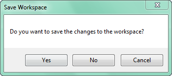

---
id: OpenWorkspace
title: Opening a Workspace  
---  
### Instructions

There are two types of workspaces: file-based workspaces and database-based
workspaces.

  * A file workspace is a workspace stored in the form of files, with the *.sxw/*.smw or *.sxwu/*.smwu file extension.
  * A database workspace saves the workspace into a database. The suppored the types of database workspace include: SQLPlus, OraclePlus, PostgreSQL, MySQL, MongoDB, DMPlus, and PostGIS and so on.

There are three ways to open a workspace.

  * The "Open" function in the "File" tab allows you to open different types of workspace.
  * In the "Workspace" group under the "Start" tab, there are two function "File" and "Database" provided for you to open different types of workspace. You can click the two buttons directly, or you can click the drop-down buttons under them to open the drop-down lists. 
  * Right-click the workspace node "Datasources" in the Workspace Manager, and then select "Open File Datasource" or "Open Database Datasource".

### The operations

### File...

Under the "Start" tab, on the "Workspace" group:

  1. Choose "File..." from the drop-down list shown by clicking "File".
  2. In the apearing "Open Workspace" dialog box, navigate to the file you want to open and then select it.
  3. Enter the password if necessary.Click Open. 

### Dtabase-based workspace

Under the "Start" tab, on the "Workspace" group, choose a database type from 
the drop-down list shown by clicking "Database" to open a database-based 
workspace. Take a workspace in the SQLPlus as an example:

  1. Click on the SQLPlus button.
  2. In the pop-up window input the necessary information and click OK.
    * Server Name: You can directly enter the SQL Server database server name, or you can click the "Server Name" combo box at the right of the drop-down list, and the server name you can access in currenct network will be listed. 

For Oracle databases, the configured service instance name in the local Oracle 
client is automatically listed.

    * Database Name: Enter the name of the SQL Server database where the workspace is located.
    * User Name: The user name with the authority of opening workspaces in the specified SQL Server database.
    * Password: The password for validation.
    * **Workspace name** : Enter the workspace name you want to open. If other parameters have been set correctly, all workspace names are listed in the drop-down list of "Workspace Name:", which helps you select the workspace conveniently.

### Note

  1. You can open only one workspace in one session. Therefore, the current open workspace must be closed before opening another workspace. When closing the current workspace, the save prompt will pop up if there are unsaved changes in it. After the current workspace has been saved and closed, the Open SQL Server Workspace dialog box will show up.
  2. Data in an open workspace, such as the datasources, maps, layouts, scenes, symbol libraries are organized in the tree catalog in the Workspace Manager based on its original structure.
  
---  
Figure: The Save Workspace prompt  

### Related Topics

To know how to deal with the Save Workspace prompt, please refer to [Start Menu/Close/Workspace](WS_Close.htm).

