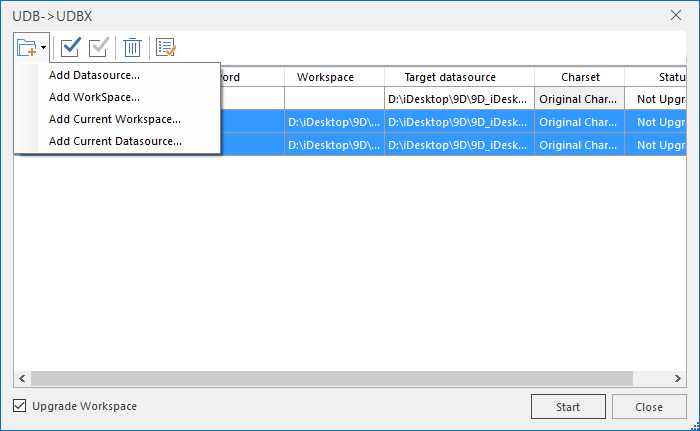

---
id: UDBUpdate
title: Conversion between UDB datasources and UDBX datasources  
---  
### Instructions

The feature **UDB->UDBX** is to convert a UDB datasource (*.udb) to a UDBX 
datasource (*.udbx) and the feature **UDBX->UDB** is to convert a UDBX(*.udbx) 
datasource to a UDB(*.udb) datasource.

Compared to the UDB datasource, the UDBX datasource has following advantages.

    * Managing a UDBX datasource is easy than managing a UDB datasource because of the UDBX datasource is a single file.
    * Avoid the data corruption problem of UDB double files caused by the program crashes unexpectedly.
    * The copy of UDBX data source performance is comparable to UDB datasource when there are no user-defined fields. As the number of fields increases, the copy of a UDBX datasource performance is much better than a UDB datasource. 
    * The searching performance of a UDB datasource decreases obviously over increasement of data volume, and the same probelm do not exist in a UDBX datasource.
    * Even a large file also can be opened quickly.

**The disadvantages of a UDBX datasource comparing to a UDB datasource** :

    * Except point data, the size of a UDBX datasource is larger than a UDB datasource after creating R-tree.
    * bounds query for a point dataset is slightly slower than the UDB engine. 

###  UDB->UDBX

    1. Click "Data" > "Tools" > "Datasource Conversion" > "UDB->UDBX" to open the "UDB->UDBX" dialog box.
  

Figure: UDB->UDBX dialog box  
    2. You can add UDB datasources directly, or you can add a workspace and all datasources in the workspace will be added. Click  drop-down button and then select "Add Datasource..." or "Add Workspace...". You can select "Add Current Workspace..." or "Add Current Datasource" to add data in the current workspace directly. 
      * **Source Datasource** : The name and path of datasource.
      * **Password** : If your UDB data has a password, you need to enter its password and then you can upgrade your data.
      * **Workspace** : If you add the UDB datasource by adding a workspace, the workspace name and path will be shown in the column. Otherwise, the item in the column is empty.
      * **Target Datasource** : Click the corresponding item to change the path and name of result data.
      * **Charset** : Now, only the "Original Charset" can be adopted.
      * **Status** : Give a prompt whether your data has been upgraded. If yes, the item is "Success", conversely, the item is "Not Upgraded".
      * **Upgrade Workspace** : Checking the checkbox means upgrading the workspace relative to the datasource you want to upgrade without replacing the original workspace. For example: the original workspace is "China.smwu" and the result workspace will be saved as "China_New.smwu" automatically in the same folder. 

**Note** : If you add a datasource directly, the program can not identify which workspace it belongs to, and so only the workspace added into the dialog box can be upgraded.

      * **Setting in a batch** : Select more than one UDB datasources and then click  button, and then in the pop-up dialog box, you can specify a path to save them. 
    3. Click "Start" to run the operation. The relevant information is output in the Output Window.

###  UDBX->UDB

The feature **UDBX->UDB** is to convert a UDBX datasource to a UDB datasource (double files), for the detail operations, please refer to "UDB->UDBX".

