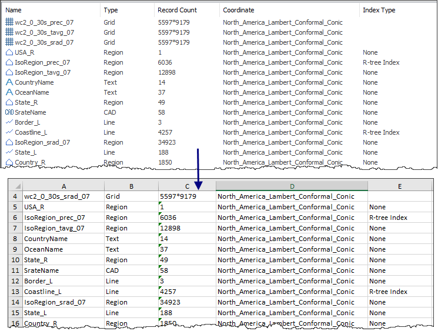

---
id: WorkSpaceView
title: The workspace manager window  
---  
The workspace manager window shows the current workspace contents in the type 
of icon tiling including datasource, map, scene, layout, and resources. The 
workspace manager window has the same abilities as the workspace manager.

Two entrances are provided to open the workspace manager window.

  * In the View group of the View tab, check Workspace Manager Window.
  * In the toolbar of the workspace manager, click the icon button  to open it and click it again to close it.

You can double click any item in the workspace manager window to check its 
subitems. For example, double click the Datasources item to check its sub 
items.

The workspace manager window will display the sub items of the selected item in the workspace manager, that is, they are linked to work.

The toobar and context menu of the workspace manager window provides abundant functions. Following content introduces each feature in detail.

  * Higher Level: return the contents of the higher level, e.g, when the current window show the datasets content, click Higher Level to show the datasource contents.
  * Backword: return the content of previous window view.
  * Forward: return the content of next window view.
  * View Type: it contains four types-Large, Small, List and Details. Details means that it will display the name, type, object number and directory of each item. The details can be used to manage each item conveniently, e.g, delete the vector dataset whose object number is 0 according to the details.
  * Sort: it provides four types-Name, Type, Created and Object Numbers. 
    * Name: Sort alphabetically.
    * Type: sort according to tabular dataset, vector dataset(point, line, region), text dataset, image, grid, 3D dataset(point, line, region), CAD and model dataset.
    * Created: sort according to the time to create data from early to late.
    * Object Numbers: sort according to the number of objects in the data in ascending order.
  * Refresh: refresh the contents of the current window.
  * Export content to a table: exporting information in the current workspace manager window to a table. As shown below, the workspace manager window list all information of datasets. After we export information to a table, we can open the table to check information.    

