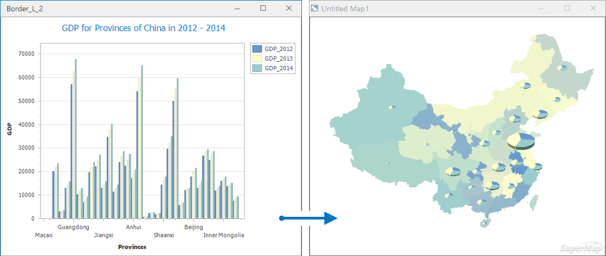
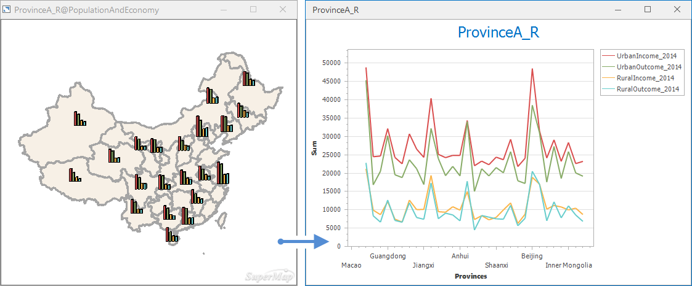

### Introductions

A diagram and a thematic map can be converted to each other to show data information in different ways.

### Convert a diagram to a thematic map

Supports converting a diagram created from a vector dataset to a thematic map. **Note** : A diagram created from an attribute table can not be converted to a thematic map directly.

Open a diagram. There are two functional entrances:

  * Entrance 1: Click on Diagrams tab > Diagram Conversion > Convert to Thematic Map to open the "Convert to Thematic Map" dialog box.
  * Entrance 2: Right-click on the current statistic diagram window and select **Convert to Thematic Map** to pop up the dialog box Convert to Thematic Map.

Set the following parameters in the dialog box.

  * **Select Map Window** : you can select which window to open the resulting thematic map. "New Map Window" means the thematic map will be opened in a new window. Or, you can check other options to open the thematic map in an existing window.
  * Select one or more types of thematic maps. Detail instructions are: 
    * A bar chart, a pie chart, a bubble chart, or a line chart can be converted to a unique thematic map, a gradient thematic map, a statistics thematic map, or a dot density thematic map and vice versa. 
    * A histogram and a thematic map can be converted to each other.
    * Converting a scatter plot, a time series diagram or a combo diagram to a thematic map is not allowed.

**Instance** : the following picture shows the conversion from a column chart to a statistic thematic map.

  
  
### Convert a thematic map to a statistic diagram

Your thematic map can be converted to a statistic graph.

**Function Entrances**

Right click a thematic map in the Layer Manager and select the **Convert to Diagram** button to open the **Convert to Diagram** dialog box.

Set the following parameters in the dialog box:

  * **Select Map Window** : In the Select Diagram Window area, set the display way for your diagram (open it on a new window or on the current existing graph window).
  * Select one type of thematic map. The supported conversion types include:
    * A unique map, a statistics map, a gradient symbol map, or a dot density map can be converted to a bar chart, a pie chart, a line chart, or a bubble chart and vice versa. 
    * Support conversions between range thematic maps and histograms. 

**Instance** : the following pictures shows the conversion from the 2014 per-capita income of urban and rural residents thematic map to a line chart.

  

  
### Related Topics

[**An overview of diagrams**](Diagrams1)

[**Diagram types**](DiagramsType)

[**Create a diagram**](CreateDiagram)

[**Interacting with
diagrams**](ConvertThemticMap)

[**Diagram template**](DiagramTemplate)

