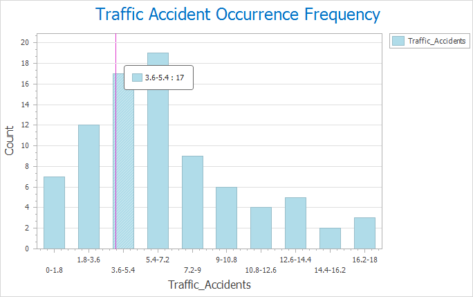

### Introductions

allows you to create diagrams based on attribute tables and vector datasets.
The supported diagram types include: column, pie, line, bubble, combo, scatter plot, time series, histogram, and so on.

### Function Entrances

  * **Way 1** : Click Start > Browse > Diagrams. And then select the diagram type you want.
  * **Way 2** : Right click your dataset and select **Add to Diagram** and the diagram type you want to create.

### Operating Instructions

Please follow the following steps to complete a diagram.

#### Step 1: create a diagram

The application will display a demonstration map window and the Diagram panel
where you set related parameters for your diagram.

#### Step 2: parameter settings

Different diagrams requires different parameters. The following content
details the common parameters and parameters unique to each type of diagram.

**The settings of common parameters**

  * **Data Settings** : Select the statistic dataset and set the display filter condition by constructing a SQL expression.
  * **Statistics Field** : Select an attribute field as the statistics field which will be shown along the axis-Y. You can add several fields. For example: You can add multiple year-field as the statistics field to count the data in different years.
  * **Aggregation Type** : The way of calculating values of statistics fields. 6 kinds of types are provided. 
    * **Count Unique** : The statistics values are the number of unique values of the group field.
    * **Sum** : The statictis field value of every feature is a sum of the attribute values of group fields you selected.
    * **Mean** : The statistics value of every feature is the average of all attribute values of the selected fields.
    * **Median** : The statistics value of every feature is the median of attribute values of selected fields.
    * **Variance** :The statistics value of every feature is the variance of attribute values of selected fields.
    * **Standard Deviation** : The statistics value of every feature is the standard deviation of attribute values of selected fields.
  * **Group Field** : Choose an attribute field as a group field which will be shown along the axis-X. Setting two group fields is allowed. Setting the group field 2 means grouping the field further based on the group field 1. When there is only one statistics field, the group field 2 can be set. **Note** : The type of group field 1 must be date for a time series diagram.
  * **Color Scheme** : Specify or customize a color scheme for the diagram. 
  * **Display Legend** : Specify whether to display the legend, if you check the box, the legend will be shown and you can double click it to change its style.

**The column, pie, line, bubble, bar diagram, and time series diagram**

Besides the common parameters, the following parameters are required for the
six kinds of diagrams.

  * **Group and Statistics Field Replacement** : Exchange the label field and the statistics field. When you check the box, the contents of axis X and axis Y will be interchanged. 
  * **Show AvgLine** : Check the box to show the average value of statistics values in the form of straight line on your diagram. If there are lots of items in your diagram, the average value of every item will be calculated and shown. 

**Instance** : Count the PM2.5 distribution of China in November 3, 2016. Set
the AQI field as the statistics field, the group field 1 is the Name field,
and the Aggregation Type is Sum. The result diagram is:    
 
  
### **The combo diagram:**

  * **Statistics Field** : A combo diagram is the combination of two charts, hence two statistics fields are required: Y axis 1 and Y axis 2 which can be set in Y Axis 1 and Y Axis 2 areas. 
  * **View** : Four types of charts are supported, Column Diagram, Line Diagram, Scatter Diagram, and Pie Diagram, of which, you can choose any two different or the same types as your needs.

**Instance** : Create a combo chart on the relationship between the population
and GDP of each province of China in 2014. Set Statistics Field to GDP_2014
field in Y-Axis 1 area and View to Column. Then, set Statistics Field in
Y-Axis 2 area to Pop_2014 and View to Scatter. The resulting diagram is shown below.      

  
**Histogram**

  * **X Axis Field** : Choose a field from the drop-down list as the grouping field which will be shown on the axis X.
  * **Range Count** : How many intervals the statistics field values will be divided into. The height of each bin denotes the frequency falling into the corresponding interval.

**Instance** : Create a histogram on the frequency of traffic accidents in
2017. Set the traffic accident as the X axis field and the Range Count is 6,
the result diagram is:      

**The scatter diagram**

  * **X/Y Axis Field** : The two fields must be numerical which be used as the x, y coordinates.
  * **Group Field** : The attibute that each scatter represents.
  * **Display Linear Regression** : The regression line is a fitted line obtained by building the regression model (finding a linear function) for the correlation between one or more independent variable and one dependent variable 

**Instance** : Create a scatter diagram on the the income and expenditure of
each province in China in 2014. Set the field Income_2014 and Expenditure_2014
as the X axis field and Y axis field respectively and the Province_name as the
group field, then the result diagram is:      

  
**The doughnut chart**

  * **Group Field** : One group field is corresponding to one annulus, and if you specify multiple group fields, you can adjust the order of group fields to change the annulus order. The first group field is represented by the innermost annulus.    
  
#### Step 3: Style Settings

  * **View** : You can switch charts in different types.Such as the conversions between a column, pie, line, bubble, and bar diagram.
  * **Style** : the program provides multiple background styles. You can choose one from the drop-down list appeared by clicking drop-down button. 
  * **Caption** : Set and modify the caption of your diagram and its font and font size.
  * **X/Y Axis Settings** : Set and modify the captions of X/Y axis, and set their font and font size.
  * **Custom Extremum** : Specifies the maximum values and minimum values of axes to limit the display range of axes to represent a better valid range of data changing.

**Style settings of the doughnut chart**

  * **As Percent** : Check the box to count the percent of every value. If you do not check the box, the statistics value will be shown on the chart. 
  * **Show Label** : Set whther to shown the result labels on the doughnut chart.
  * **Label Position** : You can specify the statistics result labels are located at the inside of the diagram, outside of the diagram, or are shown in two columns, radial shapes or tangent

### Diagram Processing

**Modify Diagram** : click **Diagrams** > **Diagrams Operation** > **Modify
Diagrams**. Or, right click on your diagram window and select **Modify
Diagrams** to modify your diagram.

**Save** : There are two ways to save a chart:

  * Way 1: Click **Diagrams** tab > **Diagrams Operation** > **Save** button to open the dialog box **Save Diagram**. Then enter the name of your chart and click **OK**.
  * Way 2: In the chart window, right click and select **Save** button to open the **Save Diagram** dialog box where you can enter the name of your chart. Click **OK** to save your diagram
  * After saving your chart, you can open it again by clicking the new chart mode under the Diagrams node in the Workspace Manager.
  * If the chart has existed in the workspace, the modification of chart will be saved into the chart. 

**Export to Picture** : Two ways to export a chart as a image.

  * Way 1: Click Diagrams > Diagrams Operation > Export to Picture to open the dialog box Export to Image where you can enter the name, width, height of the resulting picture.
  * Way 2: In the chart window, right click mouse, then select "Export to Image" button.

### Related Topics

[**An overview of diagrams**](Diagrams1)

[**Diagram types**](DiagramsType)

[**Conversion between thematic maps and
diagrams**](ConvertThemticMap)

[**Interacting with
diagrams**](ConvertThemticMap)

[**Diagram template**](DiagramTemplate)
