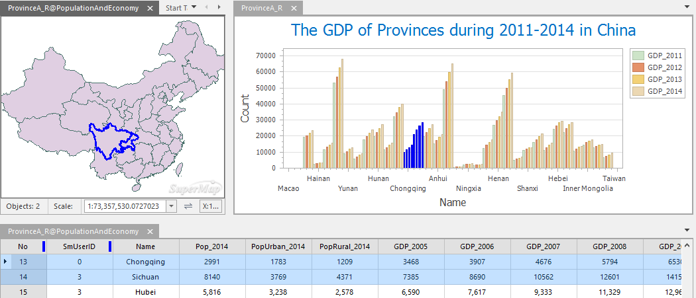
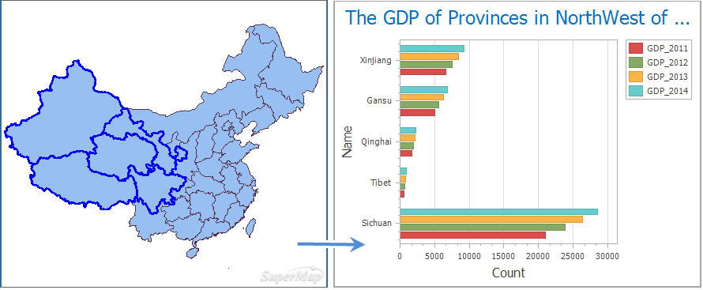

### Instructions

can associate a diagram with a map and an attribute table, which can help
users to get more effective information such as the geographic distribution
characteristics of data.

### Basic Steps

  1. Open your diagram, map, and attribute table.
  2. Click View tab > Associated Browsing, then checking the windows you want. For more details about the associated browse feature, please refer to [Associated Browse](../../Visualization/BrowseMap/WindowsBinding).
      
  
  3. The selection between an attribute table, a map, and a diagram is dynamic. If you select one or more objects in your diagram, the same objects in your map and attribute table will be selected. Similarly, a selection in your map or attribute table will also be reflected in your diagram. All selected objects will be highlighted. 
  4. **Selected Object Statistic** : You can select one or objects that interest you as a filter to create a new diagram. The operation is detailed as follows:
  * In the map window, select one or more objects, and then right-click mouse and select "Selected Object Statistics".
  * Select the diagram type you want to create.
  * If you want to view the GDP situation of 5 provinces in northwest of China, you can select the five provinces and then create a new graph, as follows:  
  

### Related Topics

[**An overview of diagrams**](Diagrams1)

[**Diagram types**](DiagramsType)

[**Creating a diagram**](CreateDiagram)

[**Interacting with
diagrams**](ConvertThemticMap)

[**Diagram template**](DiagramTemplate)
