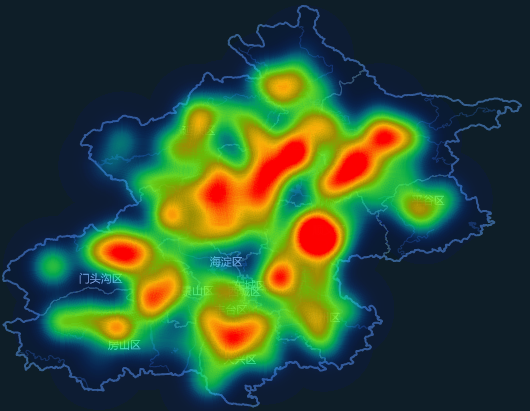
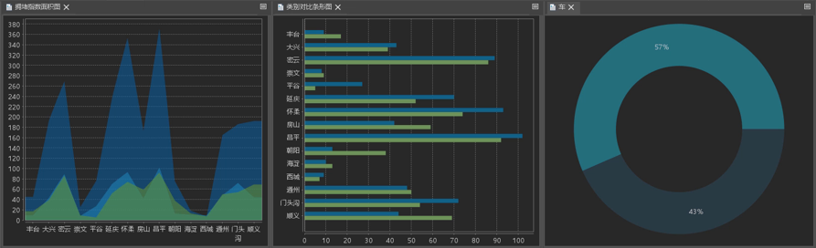

Big data is getting bigger nowadays. Therefore, we desire a new technology
with a strong ability to analyze big data, that is where data mining comes in.
The new technology is the process of analyzing big data information and
discovering trends and patterns.

A diagram is a graphic representation that shows and mine relations,
distribution, trends, and patterns of data. We can create different types of
diagrams to research relations of data and dig useful information.

SuperMap iDesktop supports creating different types of diagram based on data
attribute information.

With SuperMap iDesktop, you can perform the following operations.

  * Creating various digrams including column, pie, line, bubble, combo, scatter, time series, histogram, bar, donut, and area diagrams.
  * SuperMap iDesktop supports the conversion between a thematic map and a diagram to represent data in different ways. 
  * You can associate your diagram and map with attribute information to view different displays of data at the same time. 
  * You can export a diagram as an image for further use. 
  * You can use a predefined template to create a diagram or export your diagram as a template for further use.
  * Besides, you can add your diagram to a layout or a dashboard.

### Instances

The following map shows the traffic jam situation of Beijing in the morning
rush hour. From the map, we can roughly know about where the hot areas and
cold areas are.

   
  
To mine more information, we created several different types of diagrams to
represent traffic jam situation. From these diagrams, we can get more specific
information which can help traffic administrative departments to make decision
on traffic improvements.

  

  
### Related Topics

[**Diagram types**](DiagramsType)

[**Creating a diagram**](CreateDiagram)

[**Conversion between a diagram and a thematic
map**](ConvertThemticMap)

[**Interacting with
diagrams**](ConvertThemticMap)

[**Diagram template**](DiagramTemplate)
