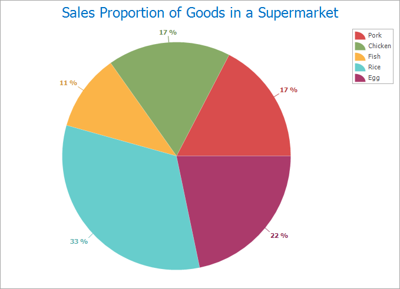

SuperMap iDesktop supports multiple types of diagrams including: column, pie,
line, bubble, combo, scatter, time series, histogram, bar, donut, and area
diagrams.

The following content details each diagram and its use.

### Column Chart

A column chart presents data distributions using a series of vertically or
horizontally different rectangles with lengths or heights.

The greatest advantage of column charts is the sizes of different data can be
shown up intuitively which makes it easier to compare differences between
data.

  
  
### Pie Chart

A pie chart is a circular statistics graphic which is divided into one or more
slices to illustrate numerical proportion and ratio.

A pie chart is often used to represent the proportion of a part to the
quantity. Such as: the proportion of a goods to the total goods in turnover of
a supermarket.

  
  
### Line Chart

Line charts represent changes of statistics quantity. A line chart can not
only show the quantity but also reflect the changes of the same thing at
different times.

The advantage of line chart is to display the changing trends of data. The
following line chart shows the air quality of Beijing from 2014 to 2017.

  
 
  
### Bubble Chart

A bubble chart is a variation of a XY scatter plot. In a bubble chart, specify
the location of a bubble through x-axis and y-axis and its size through the
third variable.

Bubble charts are often used to view the relationships between categorical
data. Such as the relationship between avian influenza events and population
in some district.

  
 
  
### Combo Diagram

A combo diagram consists of two or more different graphs. A combo diagram
could be the combination of two column charts, two line charts or a column
chart and a line chart. To make a combo diagram, at least two different
datasets with commonly used string fields are necessary.

Combo diagrams can interpret questions about data. Such as: The relationships
between GDP and population for each province in China in 2014.

  
 
  
### Scatter Plot

Scatter plots take two variables as x, y coordinates display the trend of data
and relationships between values.

Scatter plots apply to represent relationships, distribution modes between two
variables and exception values found based on distribution modes. Such as the
relationships between the number of leaks and total length of pipelines.

### Histogram

A histogram is a frequency distribution map deviding values into each bar or
interval. The height of a bar represents the frequency of items fell into the
bar.

Histograms is one kind of intuitive graph type to facilitate the display of
differences of frequencies between each group. Such as: The distributions of
qualities of products from a factory.

  

  
### Bar Chart

In a bar chart, lengths of bars represent quantities, according to numerical
values of catogories to generate different bars. Bar charts are mainly used to
summarize and compare classification data.

With a bar chart, the relative differences between catogories of numerical
data can be shown intuitively. Such as: comparing the GDP of provinces during
2012-2014 in China.

  
 
  
### Area Graph

Area graphs emphasize the speed that quantities change over time, also can be
used to draw attention to trends in total value.

When there are sum relationships in categories of data, an area chart can be
used for showing the relationships visually. Such as the relationships between
cost and income.

  
 
  
### Donut Chart

Similar to pie charts, donut charts aim to the relationships between a whole
and parts.

  

  
### Time Series Chart

The horizontal axis of the time seriers chart is used for plotting increments
of time and the vertical axis represent values of the variable that is being
measured.

  
 
  
### Related topics

[**An overview of diagram**](Diagrams1)

[**Creating a diagram**](CreateDiagram)

[**Conversion between diagrams and thematic
maps**](ConvertThemticMap)

[**Interacting with
diagrams**](ConvertThemticMap)

[**Diagram template**](DiagramTemplate)

