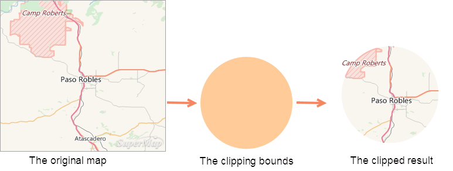
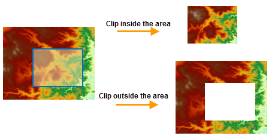
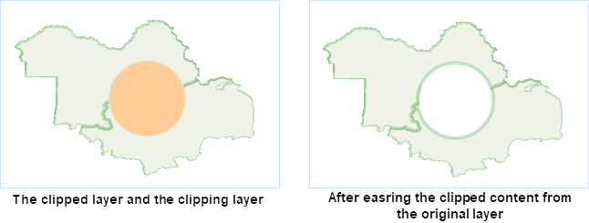
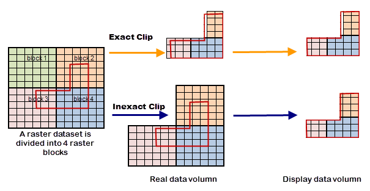

When analyzing and processing geographic data, you may only need study a small region of the map. You can use the **Map Clip** function to extract that area. At the same time, it also can reduce data volume and improve the efficiency of data processing.

You can draw rectangles, circles, polygons or select region objects in a layer to clip a layer when there is one layer or multiple layers in the map window. The clip result can be saved as a new dataset. The clipped layer can be a point layer, a line layer, a region layer, a CAD layer, a text layer or a grid layer, and both the clip layer and the drawn clip region must be region. The type of the clip result is consistent with that of the clipped layer.

* **Clip Mode**

When clipping a map, you can set the clip mode: inside or outside.

* **Inside** : The map content inside the clipping bounds will be retained and output.
* **Outside** : The map content outside the clipping bounds will be retained and output.

* **Erase Clip Region**

If the Erase Clip Region operation is performed on the clipped layer, the clip region of the clipped layer will be erased after the clip operation. Currently, the Erase Clip Region operation can only be performed on vector-format map data, and it is not supported by the grid map.

As shown in the following figure, the yellow region is the clipped layer, and the blue region is the clip layer. Select the circular region to clip the yellow polygon, and set the clip mode to Inside. The erased clipped layer is shown as below.

* **Exact Clip**

When clipping raster data or image data, you can choose whether to do the exact clipping operation from the Exact Clip drop-down list.

The differences between the exact clip and the default clip are detailed below.

1. The amount of data is different in results. 

* **Exact Clip** : The process unit is pixels in borders of clipping area. Given a pixel split by a clipping boundary, if the clipping area overlays its center point, then keep the pixel (As figure 1). 
* **Default Clip** :The process unit is raster blocks in borders of clipping area. If the clipping area intersects with raster blocks (As block 2, 3, 4 in figure 2), all intersected blocks will be kept that leads to a bigger amount of data.

2. The display effects are different. 
* **Exact Clip** : Because of processes to pixels intersecting with borders of clipping area, there are some retained parts being not whole pixels or even without any pixel in results, as figure 3.
* **Default Clip** : The result will show strickly as the clipping area.
3. The clipping efficiency is different. 
* The exact clip has higher efficiency than the default clip because of the difference of process unit. When you need to more exact storage data, the exact clip is suggested. But if the amount of data is huge and you focus on the display effect, the default clip is better. 

###  Related Topics

 [Map clip](RecanlgeClip)

