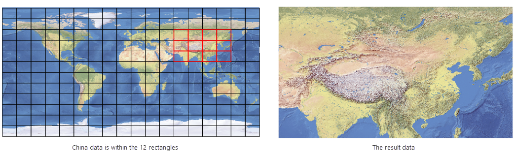

Clipping the specified layer in the map window by specifying the clipping
range. Currently supports to draw rectangles, circles, polygons, and the
selected object mode, specify the range of the map clipping cutting operation.

###  Function Entrances

**Maps** tab > **Operation** > **Map Clip**.

### Basic Steps

1. Load your layer in the current map window. Then choose a method from the drop-down list.
  * **Rectangle** : Set the crop range by drawing a rectangle.
  * **Circle** : Set the crop range by drawing a circle.
  * **Polygon** : Set the crop range by drawing a polygon.
  * **Objects** : The crop range is set by selecting one or more area objects on the clipped layer.Also can select one or more area objects in the map before executing the "object" function. In this case, you can open the Map Clip dialog box directly with the currently selected object range for further parameter setting.
2. After the clipping region is drawn, set the parameters of Clip Settings and Clip Region Settings in the Map Clip dialog box displayed.
  * **Uniform Setting** : Select multiple layers in the layer list, click the uniform setting button in the toolbar, you can set the target datasource, clip mode, erase clip region, exact clip of the selected layer in bulk.
  * **The layer list description**
* **List area** : Show all clipped layers in the current map, you can set the parameters of target datasource, result dataset, clip type, erase, exact clip. **Note** : the layer that is reserved in the layer list will be clipped, it should be removed from the list that the layer which will not be clipped.
* **Target Datasource** : Click its name to display the dropdown box, and select the datasource where the data of this layer will be saved after being clipped. The default is the source datasource where this layer is located.
* **Target Dataset** : Input the name of the resulting dataset.
* **Clip Mode** : Set the clip mode. **Inside** means clipping the map content inside the clipping region. **Outside** is opposite of **Inside**.
* **Erase** : Whether you want to remove the clipping content from your original map. **No** is by default, which means keeping the clipping content.
* **Exact Clip** : This option is applicable to the GRID dataset, DEM dataset, MrSid dataset, ECW dataset and image dataset. For details, please refer to [Exact Clip](MapClip_basic). 
  * If you select **Yes** meaning **Exact Clip**. You can clip data exactly, and abandon pixels being not within the clipping area and the result has a smaller amount of data.
  * If you select "No" meaning **Default Clip**. The operation has high clipping performance.
  * **The result settings**
* **Clip Type** : Manily aims to set the clip type as "Union Clip" or "Multi-Objects Split Clip" when you select the clip area by selecting objects (the function "Objects").
  * **Union Clip** : The clip range is the union of all ranges of all selected objects. For example, to clip China data from a world map, you can take the grid region layer as the base layer, then select the 12 polygons containing China area, the result map is as follows: 
  

  * **Multi-Objects Split Clip** : Every object is considered as a single clip area. According to the number of selected objects, save results severally. The function can be used for dividing a huge range image into a batch of small range images. 
* **Save to Same Dataset** : This is only worked for **Vector Data**. All results data will be saved into the same dataset, and you can view the range that the result data belongs to. As following pictures show, the range of the clipped data can be viewed after saving the clipped objects into the same dataset.
* Specify a field at the Result ID, then each clipped result will be named in the form of **target dataset name** plus **_** plus **the name of the field you specify** to help you identify the range of every result data.
  
  
  
**Note**:

* Only when you clip data by selecting vector objects one by one (choosing "Objects" from the Map Clip drop-down button), the setting of Multi-Objects Split Clip is available. When you select only one object or select more objects by drawing polygons, the clip type is Union Clip. 
* The differences between "Union Clip" and "Multi-Objects Split Clip with saving results into the same dataset" are: with the former, the multiple objects will be united first then clipped, and the data will not be divided within the clipping range. However, with the latter, every object will be clipped separately, and then saves each result into the same dataset. 
3. **Save Map As** : Select this option and input the map title, then the clip result can be saved as a map. For example, if you clip the thematic map layer, the style of the thematic map will be retained in the clip result after using the Save Map As command.
  * Set the parameters in the tab of Clip Region Settings.
* **List Area:** Display the position of the clip region. You can select a vertex of the clip region in the list area, and then modify the coordinate X and coordinate Y. And the map will highlight the node to facilitate the user to identify the location of the selected node.

* **Apply:** Click the Apply button after modifying the clip region (i.e. the coordinates in the list box), then the clip region after the modification can be displayed in the map window.
* **Restore:** Click the Restore button after modifying the clip region, then the region bounds before the modification can be restored.
* **Object** : When there are multiple clip objects in the map window, click the Object dropdown arrow on the right side, and select the clip region that needs to be modified. While clipping with rectangle, there can only be one clip region object and the 1st object will be displayed as the clip object.

### Note

  1. Does not support the clipping of network data.
  2. The invisible layers can also be clipped when they are selected.
  3. While clipping a text layer, a text object will be clipped if the anchor point of the text object is within the bounds of the clip region.
  4. When clipping a text layer or a grid layer, you cannot select **Erase Clip Region**.
  5. For datasets in a readonly datasource, or readonly datasets, you cannot select **Erase Clip Region**.
  6. If you check the **Save Map As** in the **Map Clip** dialog box, the result clipped map will be re-associated with the clipped dataset. If the displayed result is not correct, you need to reset parameters: **Layer Display Filter** and **Thematic Map Expression** or **Layer Associate Attribute**. 

###  Related Topics

 [Clipping Maps](MapClip_basic)
