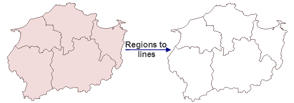

iDesktop can convert lines to regions and vice versa.

### Convert Lines To Regions

Joint the start point and end point of each line in a line dataset to construct a polygon.

If a line object is a straight line and the area of the constructed region is 0, the object can not be converted to a region. You can convert lots of closed line objects into polygons with the "[Topology Construct Regions](../Topology/TopotoPolygon)" features. 

The "Line to Region" function will connecting the starting point and the ending point of every line object. But constructing regions by topology will construct the enclosed areas into polygons.

 |  | 
---|---|---
Figure 1: The source line dataset | Figure 2: Line to Region | Figure 3: Topologically constructing region

* If there are compound objects in the input layer, there will still be compound objects in the output dataset. You can use the Ungroup command to convert the compound objects into simple objects.
* The newly created region dataset will keep the SmUserID and all non-system fields of the source dataset.

**Function Entrances**

* Click **Data** > **Data Processing** > **Conversion** > **Line to Region**
* **Toolbox** > **Conversion** > **Conversion among Points, Lines, and Region** > **Line to Region**. (iDesktopX) 

In the pop-up dialog box **Line to Region** set the source dataset that you
want to convert and specify a name for the result dataset. You can allow the
application to process your data topologically when converting your data. For
more details on topological processing, please refer to [Process Line
Topologically](../Topology/TopoProcessLine). **Note** : The operation
will change your data, please make a copy of your data before converting it.

### Region to Line

Extract the boundaries of regions resulting in a line dataset.

* The attributes of the input region dataset could be retained. The result line dataset will keep the SmUserID and all non-system fields of the source dataset.
* While converting region data into line data, the projection of the result line dataset will be identical to the source data (the region dataset before conversion).
* If there are compound objects in the input layer, there will still be compound objects in the output line dataset. You can use the Ungroup command to convert the compound objects into simple objects.

**Function Entrances**

* Click **Data** > **Data Processing** > **Conversion** > **Region to Line**
* **Toolbox** > **Conversion** > **Conversion among Points, Lines, and Region** > **Region to Line**. (iDesktopX) 

In the Region -> Line dialog box, specify the dataset to be converted and a name of the result dataset.

