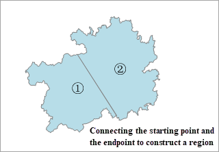

### Point to Line

It is to connect the points with the same field value according to the specified sorting field and sorting type, and then generate a new line dataset.

**Application scenarios** : converting track points with date into track lines in time sequence thereby simulator the tracing of point data.

* The system will connect the points with the same value of the specified field to create a line object; if a point object contains a unique field value, or its field value is null, it will not be processed.
* The new line dataset will keep the connection field information of the points.

**Function Entrances**

* Click **Data** > **Data Processing** > **Conversion** > **Point to Line**
* **Toolbox** > **Conversion** > **Conversion among Points, Lines, and Region** > **Point to Line**. (iDesktopX) 

**Parameter Description**

* **Connection Field** : The application will connect the points with the same attribute value to a line based on the connection field.
* **Sort Field** : The points with the same connection-field value will be connected in the order of the sort-field values. SmID is by default. 
* **Sort Type** : includes ascending and descending. 

**Notes**

* The connection field can be numeric type, wide character, or text. 
* If the connection field has no values or all values are unique, or some values are unique while the rest of values are unique, the conversion operation won't be successful.

**Instance** : we have track data in points. Now we can use the feature to convert these points to lines. Set the Sort Field to the date field.

### Line to Point

Convert vertices of lines in a line dataset into point dataset.

* For parameterized curves in the line dataset, they will be taken as polylines with several neighboring vertices. During the conversion, all the vertices will be extracted to construct the point dataset.
* The result point dataset will keep the SmUserID and all non-system fields of the original line dataset.

**Function Entrances**

* Click **Data** > **Data Processing** > **Conversion** > **Line to Point**
* **Toolbox** > **Conversion** > **Conversion among Points, Lines, and Region** > **Line to Point**. (iDesktopX) 
In the Line to Point dialog box, specify the dataset to be converted and the target dataset name and set a datasource to save the result dataset.

### Region to Point

Extracts centroids of regions in a region dataset and then turn them into a point dataset. The result point dataset will inherit the SmUserID and all non-system fields information of the source dataset. When you want to represent the position of every object with point data, you can convert region data to point data, meanwhile the attribute values can be retained.

**Function Entrances**

* Click **Data** > **Data Processing** > **Conversion** > **Region to Point**
* **Toolbox** > **Conversion** > **Conversion among Points, Lines, and Region** > **Region to Point**. (iDesktopX) 
In the Region to Point dialog box, specify the dataset to be converted and the target dataset name and set a datasource to save the result dataset.

### Line to Region

Joint the start point and end point of each line in a line dataset to construct a polygon. 

If a line object is a straight line and the area of the constructed region is 0, the object can not be converted to a region. You can convert lots of closed line objects into polygons with the "[Topology Construct Regions](../Topology/TopotoPolygon)" features.

The "Line to Region" function will connecting the starting point and the ending point of every line object. But constructing regions by topology will construct the enclosed areas into polygons.

 |  |
---|---|---
Figure 1: The source line dataset | Figure 2: Line to Region | Figure 3: Topologically constructing region
* If there are compound objects in the input layer, there will still be compound objects in the output dataset. You can use the Ungroup command to convert the compound objects into simple objects.
* The newly created region dataset will keep the SmUserID and all non-system fields of the source dataset.

**Function Entrances**

* Click **Data** > **Data Processing** > **Conversion** > **Line to Region**
* **Toolbox** > **Conversion** > **Conversion among Points, Lines, and Region** > **Line to Region**. (iDesktopX) 

In the pop-up dialog box **Line to Region** set the source dataset that you want to convert and specify a name for the result dataset.

### Region to Line

Extract the boundaries of regions resulting in a line dataset.

* The attributes of the input region dataset could be retained. The result line dataset will keep the SmUserID and all non-system fields of the source dataset.
* While converting region data into line data, the projection of the result line dataset will be identical to the source data (the region dataset before conversion).
* If there are compound objects in the input layer, there will still be compound objects in the output line dataset. You can use the Ungroup command to convert the compound objects into simple objects.

**Function Entrances**

* Click **Data** > **Data Processing** > **Conversion** > **Region to Line**
* **Toolbox** > **Conversion** > **Conversion among Points, Lines, and Region** > **Region to Line**. (iDesktopX) 

In the Region -> Line dialog box, specify the dataset to be converted and a name of the result dataset.

