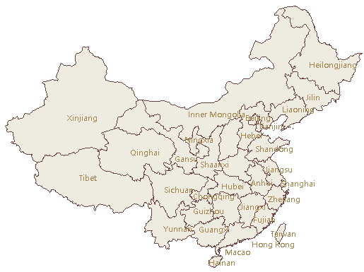
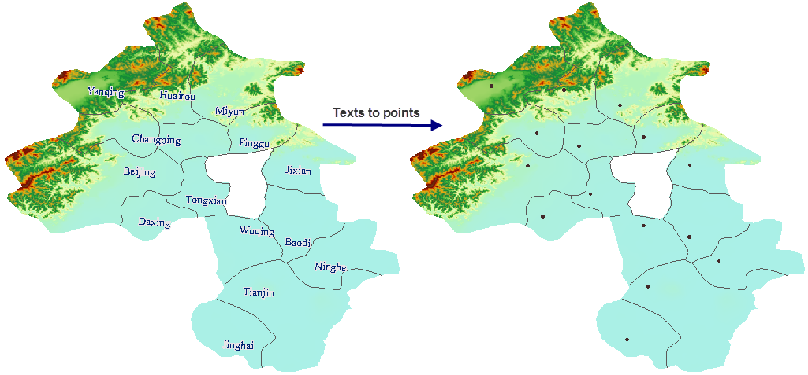
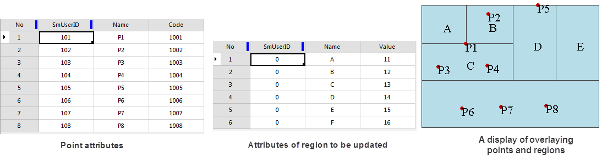
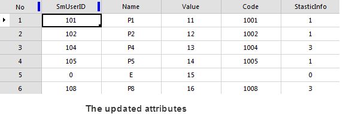

### Instructions

Convert text in a text dataset to a field of a dataset. You need to specify a field to store text information.

**Function Entrances**

* Click **Data** > **Data Processing** > **Conversion** > **Text to Field**
* **Toolbox** > **Conversion** > **Conversion among Points, Lines, and Region** > **Text to Field**. (iDesktopX) 

**Operating Instruction**

1. In the Text to Field dialog box, specify the text dataset to be converted.
2. Set the field to be operated on. There are two ways. 
  * Old Field: Save the text information into an existing non-system field. After conversion, the original information will be replaced with the text information. 
  * New Field: Input a new field name to save the text information in the newly created field. The name of the newly created field must conform to the specification. On the name specification, please refer to [Preserved Keywords List of Database](../DataManagement/DatabaseKeyWords). 
3. After all settings, you can run the operation.

### Field to Text

* Converts values of a field of a dataset to text of a text dataset, realizing the map labeling. For example, we can convert the Capital field of the capitals dataset in the World datasource into a text dataset. If we display the result text dataset and the Countries dataset in the same map window, the result text dataset actually labels the Countries dataset.
* The position of each text depends on the interior point of the corresponding object. You can modify the alignment of each text to adjust their positions.
* The function is applicable to point, line, region, text, 3D point, 3D line, 3D region, 2D network data,3D network dataset, and model network dataset.

**Function Entrances**

* Click **Data** > **Data Processing** > **Conversion** > **Field to Text**
* **Toolbox** > **Conversion** > **Conversion among Points, Lines, and Region** > **Field to Text**. (iDesktopX) 

**Operating Instructions**

1. The Field to Text dialog box lists all selected datasets. Specify a datasource to save the resulting dataset and the field to be converted.
2. If you want to convert the fields from multiple datasets, you can select multiple datasets or click the **Add** icon in the **Field -> Text** dialog box to add more datasets, and then click the **Select All** icon and **Unified Settings** button to set them in bulk.
3. After all settings, you can perform the operation. 
  

  
### Text to Point

Convert anchor points of text into point dataset. Anchor points are related to the alignment of text. The anchor points are the alignment base points of text, which could be top left corners, bottom left corners, etc. Anchor point positions could be set through the Alignment command in the Text Formatting group on the Styles tab. Please refer to [Setting Styles for Text](../../Layout/SettingStyle/TextStylegroup).

**Function Entrances**

* Click **Data** > **Data Processing** > **Conversion** > **Text to Point**
* **Toolbox** > **Conversion** > **Conversion among Points, Lines, and Region** > **Text to Point**. (iDesktopX) 

**Operating Instructions**

1. In the Text to Point dialog box, specify the dataset to be converted and a datasource to save the result dataset.
2. After all settings, you can perform the operation. 
  

  
### Attribute to Point

Create a point dataset based on the X and Y coordinates specified with the fields in an attribute table.

**Function Entrances**

* Click **Data** > **Data Processing** > **Conversion** > **Attribute to Point**
* **Toolbox** > **Conversion** > **Conversion among Points, Lines, and Region** > **Attribute to Point**. (iDesktopX) 

**Operating Instructions**

1. In the Attribute to Point dialog box, specify the text dataset to be converted and a datasource to save the result dataset.
2. Specify the X field and Y field for the saving of the coordinates of generated points.
3. After all settings, you can perform the operation.

### Attribute Point to Region

Updates the value of the non system field to the corresponding region data. The feature can update points' attributes to corresponding polygons. If the region contains multiple points, the application will randomly select one point's attributes and add a new field **StasticInfo** to count the number of points in each polygon.

* The involved fields include SmUserID and all non-system fields of point attributes.
* If there is a field from region data with the same name as a field of point data, the application will update the filed values of region data directly with the corresponding values of point data. Otherwise, the application will create a new field with the same name and in the same type as each field of point data.

**Function Entrances**

* Click **Data** > **Data Processing** > **Conversion** > **Attribute Point to Region**.
* **Toolbox** > **Conversion** > **Conversion among Points, Lines, and Region** > **Attribute Point to Region**. (iDesktopX) 

**Operating Instructions**

1. In the Attribute Point to Region dialog box, specify the dataset which you want to convert and the target dataset.
2. After all settings, you can run the conversion operation.
  

3. From the pictures, we can see: 
  * Both the point dataset and region dataset have two fields including SmUserID and Name.
  * The point dataset has a single field Code, while the region dataset has a special field Value.
  * The two datasets have the same fields but different values.

The updated result is:     
 
  * Two field are added: Code from the point dataset and a record field StaticInfo generated by system.
  * Values of the field Value are not changed.
  * Number of values of StaticInfo is the same with number of update points.
  * SmUserID and Name values of region A, B, C, D are updated by those of point P1, P2, P3, P4, P5, P8.

