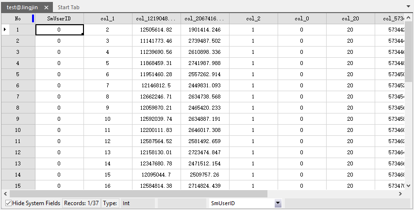

CSV (Comma Separate Values) is a format that records data in the form of text (usually using commas as separators). This format is commonly used as the data interchange format between different programs.

Users can convert attribute data in the form of *.xlsx, *.xls, and *.xml to *.csv with Excel, and import tabular data and other data in attribute table format in to .

In the meanwhile, any txt (*.txt) file that meets the csv format can be imported without converting data.

### Introduction

Note the following points:

* The head of the file can't be empty and every record is a line.
* The text can only contain separators and field values.
* By default, comma is used as the separator.  supports customizing a separator as well.
* The first record can be field name.
The following picture shows the *.csv file content to be imported: Content is separated by commas (","). The first line is the field information. There are four columns: x-coordinate, y-coordinate, type encoding, and color. 
  

  
### Functional Entrances

* Start tab > Data Processing group > Import Data. 
* Toolbox > Data Import > Spreadsheet > Import CSV. (iDesktopX). 

### Basic steps

1. In the pop up dialog box, add the csv file. For the specific way, please refer to [Import Data](ImportData).
2. On the resulting settings and source file information, please refer to [Basic Settings](ParameterSettingDia).
3. **Conversion Parameters**
  * Separator: Set the separator used in the CSV file, use the half-angle comma (,) by default. The separator character you can choose includes period (.), tab character (Tab) and white-space character. The system also support customized characters (including Chinese characters).
  * First Row as Field Info: Sets whether the first row of the original CSV file to import is the field name. If this parameter is checked, the field name imported will be the field value of the first row, it will be the attribute information otherwise. If the first row of the CSV file specified the field information, the system will read it automatically.
  * Data Preview: Preview the effect of importing CSV files into attribute table data.
4. **Import Spatial Data**
  * WKT Field: Get the spatial information of the data by specifying the WKT string field.
  * Coordinate: Specify the spatial information for the CSV data by setting the longitude, latitude, and elevation fields.
  * Click "Import" button to perform the importing operation. The result is shown below:     

  

###  Note

  1. When editing a CSV file with a text editor such as Notepad, if the contents of the column contain half-size special characters (comma, newline, or double quotation marks), use double quotation marks to include the field values to escape. If the column has quotation marks(i.e. "), they should be replaced by the half-size double quotation marks (" ") to escape, and you should also use half-size quotation marks to enclose the strings. For example, if you want to export a field value to a string like: Venture "Extended Edition", then the field in the CSV file should be written as:" Venture "" Extended Edition"" "; if you want to export a field value to a string like: "Supermap", the CSV file can be written as: ""Supermap""or" ""Supermap """. 
  2. When you edit CSV file using Microsoft Excel tool, if there are special characters in the fields, you don't have to add escape signs, because Excel will do it automatically when it is exported to a CSV file. 

