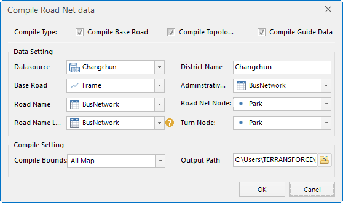

### Introduction

It is to compile a basic road data based on the related roads data including
basic road line dataset, road name table, the relationship table between the
road lines and road names, network node dataset, turn node dataset and
administrative data, and compile the topology data and guide data, at last
package the data into the navigation data which can be used in the mobile
side.

The function is based on the data from NavInfo. The original NavInfo data
format is *.mif, it's needed to be imported and then processed.

### Principles

The realization of the road network data compilation includes the following
parts: the road name renewal, the basic road compilation, the topological data
compilation, the guide data compilation, the data packing, the concrete
realization of each stage is described as follows:

* Road name renewal: according to the corresponding relationship between the RouteID and ID fields in the road name relationship table, the road name in the PathName field in the road name attribute table is updated to the basic road line data.
* Basic road compilation: Based on the updated basic road line dataset, road network node data, turn node data, the administrative division data, get the basic road data. The compiled basic road data will be added road level, grid ID, the corresponding grid number and other information.
* Topology data compilation: according to the correctly compiled basic road data, the road network node, the turn node, the sheet ID and other data, get the nodes topology relationship data, the arcs topology relationship data, and then build topology packs in level 0, 1, 2 and 3.
* Guide data compilation: according to the correctly compiled basic road data and the specified sheet ID to compile the road guide data. 
* Data packing: packing the basic road data, the topology data in level 0, 1, 2 and 3 and the guide data separately.

### Basic Steps

1. Click Data>Tools>Route Data Compilation to prompt the Compile Route Data dialog as follows. 
  

2. Select the compile type which can be Basic roads compile, Topology data compile and Guide data compile.
3. Make the following settings: 
  * Datasource: the datasource which stores the data to be compiled.
  * Basic Road: basic road line dataset.
  * Road Name: Set the attribute table data, which stores the name of the road name of the road network data, and update the road name in the PathName field to the basic road line data according to the RouteID field. 
  * Associate Road: set the relationship attribute table dataset between the basic road lines and the road names, associate the ID field of the road line dataset to the RouteID field of the road name attribute table.
  * District Name: set the folder name which stores the result data.
  * Divisions: Set the administrative division attribute table dataset of the road network dataset, which can be used to identify the administrative area around the road data.
  * Road Node: Set the network node data, which stores the topological relations, node type and other information, used to compile the guide data and topological data. 
  * Turn Node: Set the turn node data, which stores the turn directions relations, topological relations and other information, used to compile the guide data and topological data.
4. Sets the result dataset output directory and name: 
  * Output Path: The path that is used to store the packaged road network dataset, users can enter directly in the text box, or click the right button to set.
  * Compile bounds: Set the scope of the road network data compilation, click the drop-down button on the right to choose the range. You can compile all map sheets or specify a range or ID. Specific operations are as follows: 
* All Maps: the overall range.
* Specified sheet ID: if a sheet of the road network data fails to be compiled, it can be recompiled, and then be updated to the road network data. Select the "ID" in the drop-down option, and then select one or more sheet ID(s) on the prompted dialog, add them to the right side text box. It means that it will only compile the network data within the specified sheet range. 
* Specified sheet range: after selecting the item from the drop-down option, select the region dataset the range is in. 
5. Click OK to start the compilation. The result data is stored in the "BeiJing" folder set in previous steps as follows. Among them, the BK and the Topo folder stores the middle data which can be deleted; the Data folder stores the packaged basic road data, guide data and topology data. 
