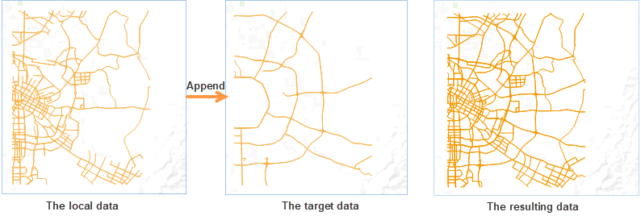

Import a dataset and append it to another dataset. The two datasets must have the same name, data type, and data structure.

### Instructions

Please pay attention to the following points when appending data:

* The two datasets must have the same name.
* The attribute table structure of the two datasets must be the same, including the number of the attribute fields, the name of the attribute fields and the attribute field types.
* The two datasets must use the same map projections.
* Appending data by importing a dataset only support vector datasets.
* Appending raster data is the procedure of raster updating actually, which updates the overlap areas between the two raster (or image) datasets

### Basic Steps

1. Click Start > Data Processing > Data Import to open the Import Data window where you can add two or more datasets with the same name.
2. After adding data, select the dataset you want to import. In the Result Settings area, set Import Mode to Append. 

When import data, Import Mode provides the operation mode when dataset names conflict.

3. After imported successfully, only one dataset will be created. Add the dataset to the map window and you can find its the splice of the datasets with the same name.

