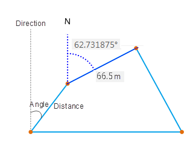
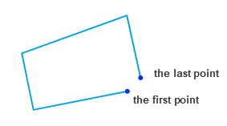
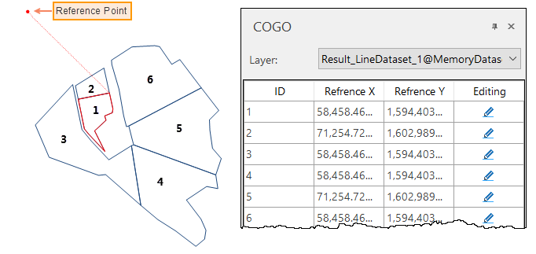

### Function Description

COGO is an acronym for Coordinate Geometry. A COGO file records relationships between coordinate points according to measurement directions, angles, and distances, thereby describing geometrical objects.

COGO files are often used in measurement or engineering design drawings. People use tools to measure distances and directions between geographic elements and use COGO files to record these information. As the following pictures shows, the user uses angles and distances to determine the position of tollbooth relative to roads.

SuperMap iDesktop introduces the **COGO** feature. It can import geometrical objects that are recorded in a Excel file as a certain format resulting in a line dataset.

**Required Fields of COGO**

iDesktop will organize objects as a special format after importing a COGO file. Every COGO object must have a unique reference point. And then, according to the given reference point, the direction, angle, and distance of each line, iDesktop will draw COGO objects one by one. A COGO file must have the following fields:

Field | Description | Remark
---|---|---
**UserID** | The ID of each line object. Points describing the same line have the same UserID. For example, given a line whose ID is 1 and described by 11 points, the UserID of each point is 1.| Required
**StartPointX** | The x coordinate of each reference point.| Required
**StartPointY** | The y coordinate of each reference point.| Required
**Lat.** | The direction of each line of each COGO object. | Required
**Deg.** |A COGO file should show each angle in the form degree-minute-second. Here is the degree of each angle. | Required
**Min.** | A COGO file should show each angle in the form degree-minute-second. Here is the minute of each angle. | Required
**Sec.** | A COGO file should show each angle in the form degree-minute-second. Here is the second of each angle. | Required
**Long.** | The direction of each line | Required
**Dist** | The length of each line.| Required

As the following pictures shows, original data has two COGO objects. The first line object with UserID 1 is described by 11 points. The second line object with UserID 2 is described by 3 points. StartPointX and StartPointY record the X coordinate and the Y coordinate of each reference point. Lat. and Long. The application will record the direction of each line of each COGO object. Deg., Min. and Sec and the angle of each line.

 

###  Import a COGO File

### Function Entrances

Click **Start** > **Import Data** > **COGO**.

### Parameter Description

* **Target Data** : specify a datasource to save the resulting dataset.
* **Source Data** : select your COGO file.
* **Close Objects** : check the box to let iDesktop close each open object by connecting the first point and the last point.
* **Reposition Last Point** : This option will be active after checking the **Close Objects** checkbox. Checking the box means that you want iDesktop to remove the last point of an open object and connect its first point and the penultimate point to close the object.

**Note** : after importing a COGO file, the application will open the resulting line dataset automatically together with the **COGO** edit panel.

### Instance

Given a COGO file that records information on 6 geomertic objects, we get a
line dataset as the following picture shows. We can view the coordinates of
each reference point in the popup **COGO** panel. Clicking on an object can
highlight its reference point.

### COGO Object Edit

You can check the reference point of each COGO object. Besides, you can move
each COGO object by modifying its reference point. Two ways are provided to
modify each reference point.

* Select the coordinates of the reference points you want to move and click on the Editing icon. Then you can move your mouse to the map window and re-specify a position for the reference point.
* You also can directly modify the coordinates of the reference point on the COGO panel.

**Note** : You can open the **COGO** panel again by clicking **Object Operations** tab > **Object Edit** group > **COGO** after closing the panel.

