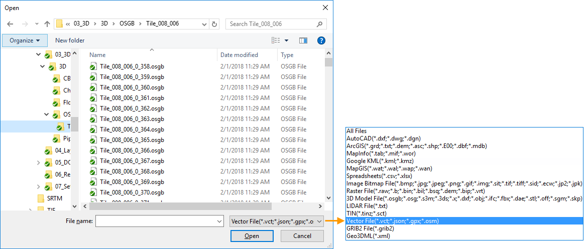

### Instructions

The Import button provides the data importing functions for supported formats.

Totally, more than 60 data formats are supported.

### Basic Steps

1. Click Start > Data Processing > Import Data to open the dialog box Import Data.
2. Click on the **Add** icon button or double click on the list area to open the Open dialog box where you can specify the file that you want to import. Setting the file format to all supported files in the dialog box Open can filter out the files supported by the application.

3. All data you added will be listed in the listbox. With the commands organized on the toolbar of the Import Data dialog box, you can add and remove data from the list.
* Source File: the name of the file to be imported. 
* displays the format of the source file.
* Type: The file type to be imported. 
* Status: Displays the file status, either Successful, Failed, or Unconverted.
4. You can select one or more files, and then set import parameters for the file(s) on the right side of the Import Data dialog box. You may need to specify different parameters for data of different formats. For general parameters, see [Parameter Settings](ParameterSettingDia).
5. To automatically close the Import Data dialog box when the operation is finished, you can check the checkbox **Auto close when finish** at the bottom of the dialog box.
6. Click Import to import all files in the listbox.
* If you have checked the Show progress bar box, you will see which dataset is being imported and how many percentage has it been imported in the Import Progress window. The overall progress will also be displayed.
* When importing the data, you can click the "Cancel" button to stop the importing.

### Note

1. By default, the files will be imported into the first non-readonly datasource displayed in Workspace Manager if no datasource is selected.The Import function will not be available if all datasets in the current workspace are readonly.
2. If all the datasources in the current workspace manager are read-only, the Import button is disabled and shown in gray.
3. If you select several vector and raster files, the parameter settings is based on the last file you selected.
4. If you select both raster and vector data, the common parameters are displayed only.
5. After the data is imported, the coordinate system of the result dataset is the same with that of the datasource by default. 
6. There are some differences between vector import and raster import. 
* Overwrite: Replace the original dataset with the same name.
* Append: For vector data, the imported will be added to the existed dataset with the same name. For raster data, the intersected region will be updated for the two datasets with the same name. See [Append Dataset](DataAppend).

