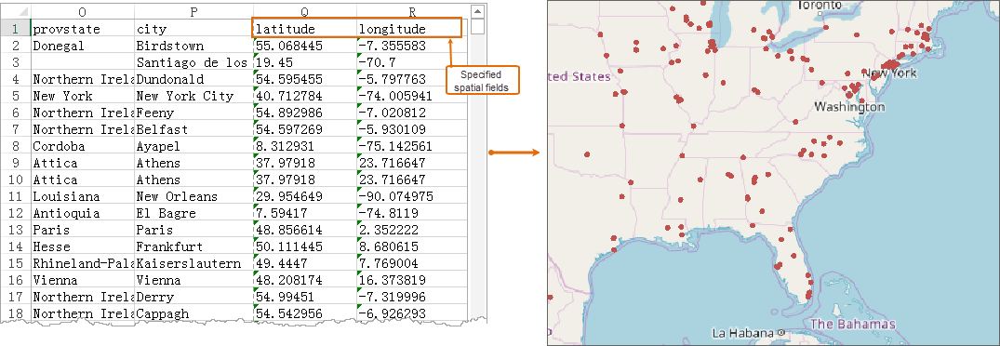

In data acquisition, the spatial information of geographic data is often
stored in the Excel file, which can improve the utilization of the existing
data.provides the ability to import Microsoft Excel files as property tables
and direct view.

Notes:

* Only data in the *.xlsx format can be imported into iDesktop.
* Import result dataset name, normally is the Excel file name plus "_" plus the sheet name.
* It will import all sheets with data by default, ignore the empty ones.
* When there are merged cells, only the first cell in the merged cell area has data.

### Functional entrances

* Start tab > Data Processing group > Import Data.
* In the context menu of a datasource or a dataset, select Import Dataset...
* Toolbox > Data Import > Spreadsheet> Import Excel. (iDesktopX)

### Import Excel

1. In the dialog box Import Data, click on the **Add** icon button to add the xlsx file. For detail operations, please refer to [Import Data](ImportData).
2. On the specific description of target datasource, result dataset, encode type, import mode, and source file information, please refer to [Public Parameters for Importing Data](ParameterSettingDia).
3. **Conversion Parameters**
  * First Row as Field Info: Set whether the first row to be the field name. Check the parameter, the first row values will be imported as the field name, otherwise as the attribute information. If the Excel file specifies the field information, the application will automatically read. 
  * **Data Preview** : preview the effect after importing your Excel file to an attribute table. 
4. **Import Spatial Data**
  * Coordinate Field: Specify spatial information relative to the specified Excel data by setting the longitude field, latitude field and altitude field.
5. Properties: click this button to view the property information of the excel file.

* Click Import to finish.

### Directly Open Excel File

supports directly opening the Excel file as a read-only attribute table. The specific operation is as follows:

In the Workspace Manager, right-click the Datasources node and select Open
File Datasource... In the pop-up dialog box, navigate to the Excel file you
want and select it. Click on Open to open the dialog box Excel Browse
Parameter Settings where you can specify how many records you want to browse.
Also, you can check the checkbox First Row as Field Info to make the first row
of the Excel table result in the fields of the resulting attribute table
dataset.

### Note

1. If the *.xlsx file name starts with a number and the name of the source file is used by the result dataset, the result dataset name will be: "Dataset_" \+ "*.xlsx file name".

