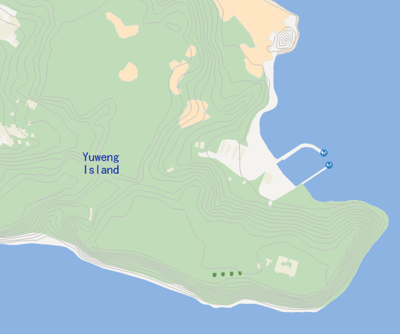

### Introduction

The GJB file is a vector data model file of military digital map, which is
saved as ASCII plain text. The military digital map vector data model employs
vector data to represent the geographical entities and the correlation among
the entities. The model employs the tree structure of 4 levels.

* The first layer is the area, the basic unit of data organization, also the basic unit of data operation and data application. In on area, the data description and topological relation of the map element are complete. The size of the area can be determined according to application needs, and the boundary of the area can be regular or irregular.
* The second layer is the feature layer and annotation layer, which is the classification organization of geographical entities in the area and also the logical unit of the area.
* The third layer contains features, which contain basic elements, conforming elements and annotation elements.
* The fourth layer contains specific basic elements, which are divided into point features, line features and polygon features.

SuperMap supports importing data from the GJB folder as point, line, polygon,
text , and tabular datasets. GJB data cannot be imported as a CAD dataset.
After importing the GJB file, you are allowed to generate a map through the
default map template.

### Functional entrances

* Start tab > Data Processing group > Import Data.
* In the context menu of a datasource or a dataset, select Import Dataset...
* Toolbox > Data Import > Import Folder> Import GJB. (iDesktopX)

### Basic Steps

1. Open or create a new datasource. Open the dialog box Import Data by click on any function entrance.
2. In the Import Data dialog box, on the toolbar, click the **Add** Folder icon and select **GJB File**. Navigate to the folder where the GJB data locates or enter the folder path directly. All sub folders will be traversed automatically.
3. On the specific description of target datasource, result dataset, encode type, import mode, and source file information, please refer to [Public Parameters for Importing Data](ParameterSettingDia).
4. **Result Settings**
* Font Conversion File: The font configuration file of GJB data. You can write the conversion relation between font size, font type and font color into a config file in advance, and then selecting the file in here to import it. Followings describe the contents and structures on *.config file for you to configure a *.config file.

Configure a font conversion file

The file contents consist of three parts: the comparison of font size, the comparison of font and the comparison of font color.

* **Comparison of font size** : As follows, FaceSizeBegin and FaceSizeEnd are the starting comparison and end comparison signs, "280100,280299,5" indicates the objects that text encoding is from 280100 to 280199 in GJB file will adopt the following 5 comparison types, in the next 5 rows, the number before the comma in a row represents the font size in GJB file, another number after the comma represents the font size after the file has been imported into SuperMap products, you can add more groups of comparison data. 

FaceSizeBegin

280100,280299,5
6,8
7,8.5
8,9.5
9,9.5
10,10

280300,280399,3
12,11
12,11
12,11
FaceSizeEnd

---
* **Font comparison** : As follows, FaceNameBegin and FaceNameEnd are the starting comparison and end comparison signs. The content before the comma is the font in GJB, the content after the comma indicates the font after the GJB file has been imported into SuperMap products. 

FaceNameBegin

Arial, Arial Black
Segoe UI, Microsoft Yahei
FaceNameEnd

---
* **Font color comparison** : As follows, FaceColorBegin and FaceColorEnd are the font color comparison starting and ending signs. Black means the font color in GJB, and the next four numbers indicate the font color after the GJB file is imported into SuperMap products. 

FaceColorBegin

Black,63,63,63,255

Green,0,160,233,255
Blue,0,160,233,255
White,255,255,255,255
None,0,0,0,1
FaceColorEnd

---
* Spatial Index: Create spatial index for the dataset.
5. **Result Display**
* Display in map: Check the box to open the imported GJB data in the map according to the map template offered by SuperMap.
6. When finished, click the Import button to import the GJB file. The display of partial of the imported data in the map is as shown below.

