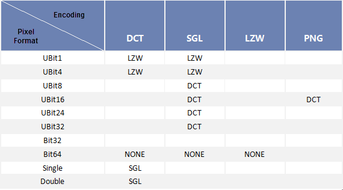

---
id: ParameterSettingDia
title: Public Parameters for Importing Data  
---  
The required parameters shown on the dialog box Import Data vary from file to file. When you select multiple files, the available parameters change as well.

* If you select both vector and raster data in the listbox, common parameters will be displayed on the right side of the Import Data dialog box.
* Even if you select either vector data or raster data with different formats, the available parameters are different.

### Common Parameters

* **Target Datasource:** Specifies in which datasource you want to place the imported file.
* **Result Dataset** : the name of the resulting dataset.
* **Import Mode:** You can select either None, Replace or Append from the drop-down list. 
  * None: changes the name of the imported file if there is already a dataset with the same name in the target datasource.
  * Overwrite: replaces the dataset with the same name in the target datasource. 
  * Append: appends the records of the imported file to the dataset with the same name in the target datasource if the two are the same type and have the same structure. If the two datasets don't have the same type and structure, the corresponding file will not be imported and the Status for the file will be shown as Failed in the listbox.

There are some differences between vector import and raster import.

* Overwrite: Replaces the original dataset with the same name.
* Append: For vector data, the imported will be added to the existed dataset with the same name. For raster data, the intersected region will be updated for the two datasets with the same name. See [Append Dataset](DataAppend).

* **Encode Type:** Specifies whether you want to save the data after compression. By default, Uncoded is selected for saving the dataset without compression. For more about encodings, please refer to [Encoding Modes for Dataset Compression](../DataManagement/EncodeType). 
  * For different types of datasets, encoding modes will be automatically assigned.
  * For image and grid datasets, the appropriate encoding will be assigned according to the pixel format while being imported. If the encoding specified by the user is not consistent to the pixel format, the encoding will be rectified and the dataset with the right encoding will be imported. The table below lists the reasonable encodings for different pixel formats of image and grid datasets.
Tab. Encoding rectification for grid and image datasets  
---  
  
* **Source File Info**
  * **Source Folder** : The path of your file to be imported. You can copy and paste the path to check your file. 
  * **Charset** : Specify the charset used by the source data. Please refer to [Charset List](../DataManagement/Charset) to check charset supported the application. 
  * **Properties** : click on this button to view the attributes of your file to be imported.

### Note

1. If several raster or vector data files are selected in the listbox, the available parameters depend on the last selected file.
2. If both raster data and vector data are selected in the listbox, common import parameters will be displayed for you to set.
3. When importing a single band raster data, the import mode None and Append is the same, that is when importing a data with the same name of an existing dataset, the system will modify the name of the data automatically.
4. When importing RAW file, the result type can only be image dataset.

