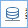

---
id: CatalogManagement
title: Catalog  
---  
### Instructions

Catalog in  is a catalog management window which organizes and manages workspaces, datasources and directories in the form of catalog tree and allows you to establish connections to your database-based datasources or online services. You can add the most often used directory into the catalog for further usages. With the Search box, you can quickly locate the folder or data item you want. The specific features include:

  * **Recently Used** : Lists workspaces and datasources recently used.
  * **Folder Connections** : Connects a local directory or remove an existed connection. Meanwhile, you can create or delete a datasource in the connected folder.
  * **Filter the local files** : Only the files supported by SuperMap can be listed under the node like file-based datasources (*.udb). You can double click an external raster file (*.png, *.tif, *.img) or vector file (*.shp, *.mif, *.tab, *.dwg) to open it, or right click it and select "Import Data" to import it into your datasource.
  * **Database** : supports opening a database-based datasource and recording the connection.
  * **Online Services** : Supports opening a Web service and retaining the connection for further usage.
  
The key to using Catalog is the establishments of connections to folders, databases, and Web services. Following contents detail how to establish connections.

###  Recently Used

Under the node, there are two child nodes: **Workspace** and **Datasource**.
The datasources and workspaces which are used recently will be shown under the two nodes, and you can click any one of them to open it directly.

###  Home file connection

The Home Link is a connection to SampleData folder for the product installed in your computer. But for a green package, the Home Link is a connection to the bin folder. You can right-click the node to modify the connection.

###  Folder Connections

Under the node, you can establish some connections to folders to access data in these folders. Only the files supported by SuperMap can be shown here. You can double click any one of files to open it or right click it and select "Import Data" to import it to your datasource.

You can follow steps below to connect to a folder:

  1. Right click the "Folder Connections" node and select "Add Folder Connection".
  2. In the File Path dialog box, navigate to the folder to be connected and select it.
  3. Click "OK", and connections to the folder and its child folder are established.
  4. All folders under the node can be managed with the context menu: 
    * **Disconnect Folder** : To disconnect the connection between the application and the folder including its sub-folders.=
    * **New File Datasource** : To create a new file-based datasource (*.udb) under the selected folder.
    * **Open Folder** : To open the selected folder.
    * **Copy Path** : To copy the path of selected folder.
    * **Delete** : to delete a folder or data from your disk. This operation is irreversible. 
    * **Refresh** : to refresh the folder.

###  Database

The node is used for establishing connections between the application and your database-based datasources, and then showing the established connections.

To add a connection, you can:

  1. Right click the node and select "Connect Database" to head to the "Open Database Datasource" dialog box.
  2. Open your database-based datasource. For details on how to open a database-based datasource, please consult [Open a Database-based Datasource](OpenDatasource#1).
  3. After that, the connection between the application and the datasource is retained.
  4. If you want to remove a connection, right-click it and select "Delete".

###  Online Services

The node is used for establishing connections between the application and Web map services, and then showing the established connections.

To add a connection, you can:

  1. Right click the node and select "Connect Service" to head to the "Open Web Datasource" dialog box.
  2. Open the web datasource you want. On how to open a Web datasource, please refer to [Open Web datasources](OpenDatasource#2).
  3. After that, the connection between the application and the Web map service is added under the node.
  4. If you want to remove a connection, right-click it and select "Delete".

### Note

You can check or un-check the "Catalog Manager" box in the View tab to show or hide the Catalog Manager window.
