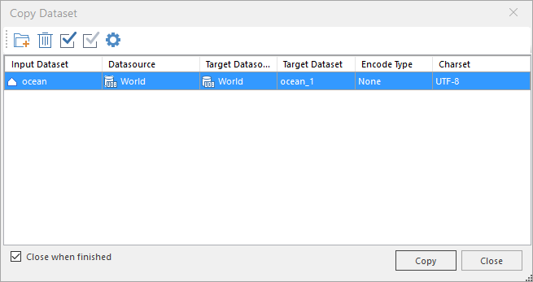

### Instructions

The "Copy Dataset" function is used to copy one or more datasets to the target datasource. The selected dataset can be added to the "Copy Dataset" window directly.

You can also copy and paste dataset by means of unsing shortcut keys: Ctrl C and Ctrl V.

### Basic Steps

  1. In the Workspace Manager, select the dataset you want to copy. You can select several datasets at the same time using Shift + click or Ctrl + click. 
  2. Right click the dataset you want to copy, and then select Copy Dataset... to display the Copy Dataset dialog box.    
---  
Figure: The Copy Dataset dialog box  
  3. Also, You can drag the dataset to be copied to the data source node in the workspace manager, and click "OK" to copy to the specified data source.
  4. To add more dataset, click "Add" button in the "Copy Dataset" dialog box and select the datasets you want to copy is the "Select" window that shows up. 
  5. Set the necessary information needed for copying the datasets. All datasets that will be copied are listed in the box and you can set parameters for each item.

Parameters you can set include:Type: The type of the dataset you want to copy.

    * Input Dataset: The dataset type and name.
    * Datasource: The datasource where the input datasource is located.
    * Target Datasource: The datasource to which you want to copy the dataset. You can click the drop-down arrow in the Target Datasource column to select a datasource from the list of all open datasources in the current workspace.
    * Result Dataset: The name of the new dataset. Though a default name is assigned, you can change it.
    * Encode Type: the encoding of the new dataset, all the encoding types are listed in the dropdown list. For more information about data encoding, see: [Encoding Modes for Dataset Compression](EncodeType.htm).
    * Charset: By default, the charset of the result dataset is as the same to the source dataset. You can change the charset. See [Charset table](Charset.htm). 
    * **With SmID:** Set whether to keep original SmID field values.

The common buttons for copying dataset is on the top of the dialog, including: Add, Remove and Select All, Select Inverse and Advanced.
Toolbar description

      * Add: Add datasets to the list.
      * Remove: Remove datasets from the list.
      * Select All: Select all datasets in the list.
      * Inverse: Select the inverse datasets in the list.
      * Advanced: If you have selected more than one dataset in the list, you can click Advanced to display the Advanced Settings dialog box for uniform parameter settings. More specifically, you can set the target datasource, encoding, charset, and SmID for several selected datasets together.

  6. When finished, click OK at the bottom to copy all datasets to the specified datasources.

### Note

    1. The Copy Dataset... command is only active if there are selected datasets in the workspace.
    2. You can not copy datasets in different datasources at the same time.
    3. When you copy a dataset from a UDB datasource to an Oracle or SQL Server data source, if there are text fields in the dataset, the text fields in the dataset will be converted to wide-character fields to ensure that the multilingual languages in the UDB can be properly stored.

