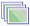

### Introduction

The image dataset collection is used to store a series of image data in the
same region or the same period. The application supports for creating the new
image dataset collection in the UDB, Oracle, SQLServer and PostgreSQL
datasources. The essence is to create an empty dataset that can be stores many
image datasets, After created successfully, you can load the image datasets to
the empty image dataset collection. In the New Dataset group of the Start tab,
click the Image button , so a new image dataset
collection is created. The buttons in this group can be used only when the
workspace has the opened datasource.

### Basic Steps

  1. Click the Image Set button of gallery control on the New Dataset group
  2. Pop up the " **New Image Set** " dialog box. 

You can add, delete or sort datasets in the subsets list, please see: [Manage
Image data](ManageImageCollection.htm).

On the Settings zone, you can set basic parameters for image dataset set:

If the first subset added in the list is the image dataset in the datasource,
then parameters on the right zone will be automatically set up according to
the attributes of the dataset;

If the first subset added in the list is an image file, then user needs
setting parameters on the right zone manually, according to the practical
information of the image file; otherwise the file cannot be added due to
inconsistent number of bands.

  
---  
Figure: The New Dataset dialog box  
    * **Target Datasource:** Sets the target datasource which contains the new dataset.
    * **Dataset Name:** Sets the dataset name.
    * **Encoding:** This option is provided only for line and region datasets, it's the encoding of the new dataset, all the encoding types are listed in the drop-down list. For more information about data encoding, see: [Encoding Modes for Dataset Compression](EncodeType.htm).
    * **Pixel Format:** Gets or sets the pixel format of the result image dataset set. Default is 32-bit unsigned. The format of image file or image dataset added in the list is recommended to be consistent with that of image dataset set. For more information, see: [Pixel Format of Raster Dataset](..\\..\\Analyst\\VectorRasterConvert\\PixelFormat.htm).
    * **Band:** Sets the number of bands of the result image dataset set. The number of bands of image file or image dataset added in the list is recommended to be consistent with that of image dataset set.
    * **No-value:** Sets the no-value of the result image dataset set. This parameter doesn't modify the original data, which is mainly used for removing the dark side of the pyramid image of the image dataset set. Combined with the [Transparency](..\\..\\Visualization\\VisualSetting\\Imagegroup-en.htm)setting, the dark side of the pyramid image can be completely moved.
  3. Create "OK" to create an image dataset set which has already been added with the subsets. 

If no subset is in the left list, then a null set will be created.

  4. Select the new image dataset collection in the Workspace Manager, and then click Properties to check the property information. 

**No-value:** Sets the null value for the image dataset. The pyramid of the
image dataset set must be recreated after the no-value is modified.

**Dataset Count:** Click the "Settings" button to manage the image dataset
set. For more information, see[Manage Image Data](ManageImageCollection.htm).

**Visible Extents:** Each image dataset collection has a clip polygon which
controls the display extent of all the subdatasets. Each subdataset has its
own clip polygon which controls its display extent within the collection's
clip polygon.

  
---  
Figure: The Properties of image dataset collection  

* * *

|

  
  
---|---

