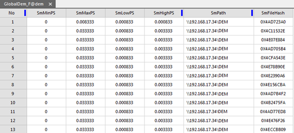
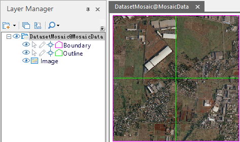

Managing images through the mosaic dataset can be considered as the procedure
of adding images into a library. Different types of images(tif, tiff, img) can
be added into the same mosaic dataset.

The mosaic dataset records the meta information of images like paths,
outlines, resolutions, and so on without copying images.

###  Data Preparation

Before adding images, you should know about some basic information, like the
size of images, the amount of images, if the image pyramid has been created.

  * According to the size and amount of images, how long adding images will take and how many disk space will be occupied can be assessed. For example, adding DEM data that resolution is 30 meter, the amount of images is 22667, and its size is 0.98T into a mosaic dataset from a UDB datasource, takes 14 minutes. The sizes of result udb and result udd are 16MB, 22MB respectively.
  * The two aspect (can be done before or after the images are added into the mosaic dataset) that an image pyramid has been created for the mosaic dataset and images are saved in blocks can improve the dispaly efficiency of images dramatically. 
  * The creation of image pyramid, the coversion to block storage, the generation of image tiles can be performed in a multi-threaded manner. So, a computer with high configuration can make the execution efficiency more high.
  * Besides the requirement resources on adding images into a mosaic dataset, you also should know whether the contents of images are specular reflection or altitude involved in the which diplay mean will be adopted for coloring the image map.
  * View the projection information of images to ensure its accuracy. If there are some erros on the projection information, you should correct first. Understanding the projection information of images can help you set a coordinate system for your mosaic dataset to correctly display images. 

### Basic Steps

This function can be used only when there existed a datasource in current
workspace.

  1. Click Start>New Dataset>Mosaic Dataset , it will pop up a dialog.
  
---  
Figure: Build Mosaic Dataset Dialog Box  
  2. The toolbar provides tools to add or delete the image data. The mosaic dataset will record the absolute directory information of the image data. When an image is added to a mosaic dataset, it is displayed by using the geographic coordinate system of the mosaic dataset, but does not make any changes to the original image file. 
    *  image button: add specified image files (*.img, *.tif, *.tiff, etc) to current list. 
    *  image button: add all images in the specified folder. 

Click Add Folder button, and a dialog box will pop up, where users can specify
the folder directory, image type, and whether to search files in subfolders.
Supported image types include: IMG, TIFF.    
---  
Figure. Add Folder dialog box  
  
    *  image button: Add image files by adding your list file 
    *  image button: Check whether the current images are on block level storage. The Block Storage will show the correct result. For specific information about the block level storage, please refer to [Convert Image to Block](ImageConvertToBlock.htm). 
    *  image button: it will refresh the status of data like the current status of each sub dataset.

  3. The list area displays the basic information of the sub datasets: 
    * Alias: the displayed name after the sub dataset is added.
    * Name: the name of the sub dataset. If the added sub dataset is a dataset in the datasource, only the name of the image dataset is displayed; if the added sub dataset is an image file, the disk path where the image file is located is displayed.
    * Status: Check whether the file exists or not.
  4. Choose a datasource from Datasource to save your mosaic dataset, and type its name into Dataset. 
  5. Add Clip File: When the projection of image data are transformed, some distortions will come out. You can clip and process the non-value area with the help of the sub dataset of your mosaic dataset to display the valid area. The format of a reference file is *.shp. For details, please consult [Image map configuration - build valid area](MosaicDatasetMapConfig.htm#1). If there existed the corresonding .shp file in your image folder, check the checkbox, otherwise the application will call the contour data of each image as the clipping range. 
  6. **Target Coordinate System** : After adding all image files, iDesktop will set the coordinate system of the created mosaic dataset to the coordinate system of the first image. The application provides three ways for the settings of target coordinate system as well. 

Coordinate Information: It displays the detailed coordinate parameters information.

* Click OK to create a mosaic dataset. The created mosaic dataset node will be added under the datasource node in the Workspace Manager.

  * **Footprint** is the base that the mosaic dataset stores and organizes images. The footprint dataset is a region dataset with every polygons denotes the geographic range of a single image. The distribution and coverage situation of images can be browsed with the footprint.    
---  
Figure: Mosaic Dataset Result  
  
The footprint also manages some meta information of images like the storage
position, the maximum and minimum resolutions, sometimes the shooting time,
and manufacturers, etc..

  
---  
Figure: The attribute table of footprint dataset  
  * **Boundary** is a region dataset and every polygons can be used for setting the display range of mosaic dataset. It is constructed based on the footprint by default. You are allowed to customize the range or specify objects to rebuild boundaries thereby show the images within the new boundaries.
  * **Clip** is a region dataset too, and every object controls the display scope of every image. The dataset is generated based on the clipped file you select when creating your mosaic dataset. If there is no a clipped file, the Clip dataset will be created based on the footprint. 

* In the Layer Manager, a mosaic dataset consists of three portions: Boundary, Outlet and Image. As follows, the mosaic dataset includes 4 images which are displayed in the map window, among them, the pink polygon indicates the boundary, and the green polygon is the outline, and the last one is the displayed image dataset.
  
---  
Figure: The structure of mosaic dataset  
  
  * **Boundary** : The spatial reference of image outline based on the mosaic dataset. Reflects the real boundary of the image data in the mosaic dataset.
  * **Outlet** : It is built based on the image's boundary. The display of mosaic dataset can be changed dynamically by adjusting the range of boundary. If necessary, existed vector boundaries or administrative division can be used to replace the original boundary of mosaic dataset to change the display effect.
  * **Image** : All images which have been added into the mosaic dataset.

### Related Topics

 [Mosaic Dataset Overview](MosaicDataset-en.htm)

 [Display of Mosaic
Dataset](MosaicDatasetView-en.htm)

