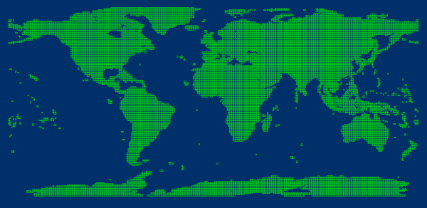

Managing images through the mosaic dataset can be considered as the procedure of adding images into a library. Different types of images(tif, tiff, img) can be added into the same mosaic dataset.

The mosaic dataset records the meta information of images like paths, outlines, resolutions, and so on without copying images.

###  Data Preparation

Before adding images, you should know about some basic information, like the size of images, the amount of images, if the image pyramid has been created.

* According to the size and amount of images, how long adding images will take and how many disk space will be occupied can be assessed. For example, adding DEM data that resolution is 30 meter, the amount of images is 22667, and its size is 0.98T into a mosaic dataset from a UDB datasource, takes 14 minutes. The sizes of result udb and result udd are 16MB, 22MB respectively.
* The two aspect (can be done before or after the images are added into the mosaic dataset) that an image pyramid has been created for the mosaic dataset and images are saved in blocks can improve the display efficiency of images dramatically. 
* The creation of image pyramid, the conversion to block storage, the generation of image tiles can be performed in a multi-threaded manner. So, a computer with high configuration can make the execution efficiency more high.
* Besides the requirement resources on adding images into a mosaic dataset, you also should know whether the contents of images are specular reflection or altitude involved in the which display mean will be adopted for coloring the image map.
* **View the projection information** : to ensure that all images display perfectly after mosaic, we should check what coordinate system each image use and which coordinate system the resulting map will adopt. The following content introduces how to set coordinate systems for mosaic datasets properly. (iDesktop allows you to open your image directly as opening a file-based data source to check its coordinate system).
1. If the given images use the coordinate systems different from the one used by the map, we suggest setting the coordinate system of the mosaic dataset the same as the map's coordinate system. 

For example, the given images use China2000 zoning projection, while the map's
coordinate system is the China2000 coordinate system. How to display these
images organized in a mosaic dataset precisely? One way is that we set the
coordinate system of the mosaic dataset to China2000. The application will
convert the images' coordinate system from China2000 zoning projection to the
China2000 coordinate system automatically when displaying them on a map.
Another way is that we set the coordinate system of the mosaic dataset the
same as the images. When displaying images on a map, the system can display
images by using the China2000 coordinate system dynamically. Compared to the
first way, the second way has lower efficiency. Therefore, we suggest using
the first way.

2. If the given images use the same coordinate system as the map, we suggest that the mosaic dataset adopts the same coordinate system as well.
3. If the given images use plane coordinate systems in iDesktop, and we know the real coordinate system used by each image, we can:

(1)Instead of processing images, set the coordinate system of the mosaic
dataset to their real coordinate system. The map must use the same coordinate
system as well. For example, the real coordinate system of the given image is
China2000 zoning projection. Then, set the coordinate system of the mosaic
dataset to China2000 zoning projection. Since the images are lack of
coordinate systems, the Dynamic Projection feature can not work. Therefore, to
display images precisely, the coordinate system of the map must be the same as
the mosaic dataset.

(2)Set the coordinate system of the given images to their real coordinate
system in iDesktop. Then set the coordinate system of the mosaic dataset
according to the option 1 or the option 2.

### Basic Steps

This function is available only when there is a datasource opened in current workspace.

1. Click Start > New Dataset > Raster > Mosaic Dataset to open the dialog box Build Mosaic Dataset.
2. The toolbar provides tools to add or delete image data. The mosaic dataset will record the absolute directory information of the image data. 
* **Add File** image button: add specified image files (*.img, *.tif, *.tiff, etc.) to the current list.
* **Add Folder** image button: add all images in the specified folder. Click Add Folder button to open the dialog box where you can specify the folder directory, image type, and whether to search files in subfolders. Supported image types include IMG and TIFF. 
* **Add List** image button: Add image files by adding your list file 
* **Check that the image is storaged as a block** image button. The Block Storage will show the correct result. For specific information about the block level storage, please refer to [Convert Image to Block](ImageConvertToBlock). 
* **Refresh** image button: it will refresh data status like the current status of each sub dataset.
3. The list area displays the basic information of the sub datasets: 
* Alias: the displayed name after the sub dataset is added.
* Name: the name of the sub dataset. If the added sub dataset is a dataset in the datasource, only the name of the image dataset is displayed; if the added sub dataset is an image file, the disk path where the image file is located is displayed.
* Status: Check whether the file exists or not.
4. Add Clip File: When the projection of image data are transformed, some distortions will come out. You can clip and process the non-value area with the help of the sub dataset of your mosaic dataset to display the valid area. The format of a reference file is *.shp. For details, please consult [Image map configuration - build valid area](MosaicDatasetMapConfig). If there existed the corresponding .shp file in your image folder, check the checkbox, otherwise the application will call the contour data of each image as the clipping range. 

Every clipping region is saved in a shapefile file with the same name as the
corresponding image. These shapefiles must be saved in the same position as
the images. For more specific information, please refer to [Displays of Mosaic
Datasets](MosaicDatasetView).

5. **Target Coordinate System** : After adding all image files, iDesktop will set the coordinate system of the created mosaic dataset to the coordinate system of the first image. The application provides three ways for the settings of target coordinate system as well.

* Click OK to create a mosaic dataset. The created mosaic dataset node will be added under the datasource node in the Workspace Manager.

* **Footprint** is the base that the mosaic dataset stores and organizes images. The footprint dataset is a region dataset with every polygons denotes the geographic range of a single image. The distribution and coverage situation of images can be browsed with the footprint.  

The footprint also manages some meta information of images like the storage
position, the maximum and minimum resolutions, sometimes the shooting time,
and manufacturers, etc..

* **Boundary** is a region dataset and every polygons can be used for setting the display range of mosaic dataset. It is constructed based on the footprint by default. You are allowed to customize the range or specify objects to rebuild boundaries thereby show the images within the new boundaries.
* **Clip** is a region dataset too, and every object controls the display scope of every image. The dataset is generated based on the clipped file you select when creating your mosaic dataset. If there is no a clipped file, the Clip dataset will be created based on the footprint. 

* In the Layer Manager, a mosaic dataset consists of three portions: Boundary, Outlet and Image. As follows, the mosaic dataset includes 4 images which are displayed in the map window, among them, the pink polygon indicates the boundary, and the green polygon is the outline, and the last one is the displayed image dataset.

* **Boundary** : The spatial reference of image outline based on the mosaic dataset. Reflects the real boundary of the image data in the mosaic dataset.
* **Outlet** : It is built based on the image's boundary. The display of mosaic dataset can be changed dynamically by adjusting the range of boundary. If necessary, existed vector boundaries or administrative division can be used to replace the original boundary of mosaic dataset to change the display effect.
* **Image** : All images which have been added into the mosaic dataset.

### Related Topics

 [Mosaic Dataset Overview](MosaicDataset)

 [Display of Mosaic Dataset](MosaicDatasetView)
