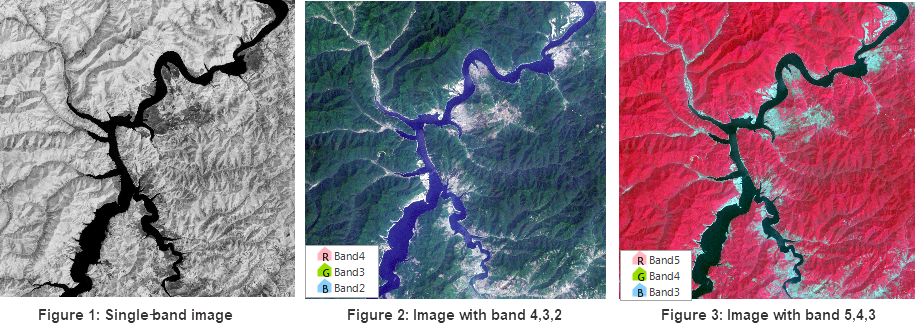

---
id: DTgroupDiaImage
title: Image Dataset  
---  
The properties of the image datasets are classified into 3 groups: General Info, Image Dataset and Projection Info. Each group of the properties are introduced in detail below:

### General Info

You can click "Dataset" panel on "Properties" window to view property information of the grid dataset.

**Basic Info:**

  * **Name** : The name of the dataset.
  * **Type** : The type of the dataset.
  * **Table Name** : For a database-based datasource, the value is the name of the table corresponding with the dataset in the database. For a file-based datasource, the value is the name of attribute table of the dataset.
  * **Encode** : The encoding mode of the grid dataset. For more information on different encoding modes, please refer to [Encoding Modes for Dataset Compression](EncodeType).

**Dtaset Bounds:**

  * **Top, Bottom, Left and Right** : The top, bottom, left and right boundary of the image dataset. The unit of values is identical to that of the dataset.
  * **Copy and Paste** : Copy and paste current dataset range by clicking Copy button and Paste button.

**Description:**

  * The descriptive information about the image dataset. You can modify it according to your needs.

### Coordinate

The "Property" panel displays the projection information of the current image dataset.

  * **Coordinate System** : The name of the coordinate system employed by the image dataset.
  * **Unit** : The distance unit of the image dataset.
  * **Coordinate Information** : The specific projection information of the image dataset.

Buttons in the toolbar of the Coordinate panel.

  * **Reset** : Reset the projection of the image dataset. Please refer to [Projection Settings Window](../Projection/PrjCoordSysSettingWin) for detail settings.
  * **Copy** : Click Copy button to copy coordinate system information as projection information of current dataset. You can copy information from the existed datasource or dataset or local projection information file (seven kinds of files: *.TIF, *.SIT, *.IMG, *.SHP, *.MIF, *.TAB, *.XML). 
  * **Import/Export** : Import a projection file or export the projection of the image dataset as an .xml file.
  * **Convert** : This button is to convert the projection information of the image dataset. For detail settings, please see [Convert projection](../projection/ConvertPrjCoordSys). 

### Image Properties

You can click a child node under the Image Dataset node to display the dataset information about the corresponding image dataset.

**Image Properties:**

  * **Band Count** : Displays the number of bands included in the multi-band image dataset. 
  * **Resolution X** : The resolution in the X direction.
  * **Resolution Y** : The resolution in the Y direction.
  * **Raster Block** : The size of grid block.
  * **NoValue** : Display the NoData of the specified band. 
  * **Rows** : The number of rows of the pixel matrix for the image dataset.
  * **Columns** : The number of columns of the pixel matrix for the image dataset.

**Band Info** :

  * **Index** : Displays index of the currently displayed band of the multi-band image dataset. 
  * **Name** : Displays the names of all the bands. 
  * **Format** : Displays the pixel format, that is, how many bits for each pixel. 

**Band combination** : For single-band images, iDesktop can freely combine
them to multiple-band images and display them. Images acquired from every
satellite sensor have different bands and those that have the same band are
saved in a file. Combining images that have different bands can highlight
different information. For example, after importing the Landsat 8 data,
iDesktop combined the popular bands and rendered to obtain the most intuitive
data information. The imported single-band data is shown in Figure 1 below.

  * **Add band** : Click on the icon button Add to open the dialog box Select where you can add other datasets for the band combination.
    * Band 4,3,2 combination is as close to true color. It is used for agricultural farm researches.
    * Band 5,4,3 combination is a false color combination. It is used for studing vegetation types and water bodies.
  
 
  * **Remove** : Select the added single-band images and click the icon button Remove to remove the band from the band combination. 

**Others:**

  * **Pyramid** : Whether the application has created the pyramid for the image dataset.
  * **Visible Bounds** : The visible bounds of the image dataset on the map. Content outside the bounds is invisible. 

Click the Settings button to open the dialog box Set Visible Bounds where you
can select a region dataset as the visible extent. Or, you can click
 and type the filter conditions to control the visible
extent. Please refer to [Projection
Transformation](../Projection/ConvertPrjCoordSys) for specific
information.

Click on the button "Reset" to display the whole bounds of the dataset.

