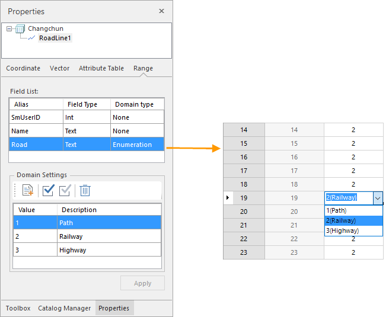

If one or more vector datasets are selected in the workspace manager, the contents displayed in the Properties panel include: Property Info, Projection, Vector Dataset, Table Structure, and Domain Info.

Property Info

  1. Click the Property Info in the "Properties" panel, the panel will display the attribute information of the dataset, including the basic information of the dataset, the dataset bounds information and the detailed description of the dataset.

**Basic:**

    * Dataset: The name of the dataset.
    * Type: The type of the dataset.
    * Table: The name of the attribute table of the dataset.
    * Encoding: The encoding mode of the vector dataset. For more information on different encoding modes, please refer to [Encoding Modes for Dataset Compression](EncodeType.htm).

**Extent:**

    * Top, Bottom, Left and Right: The boundary of the grid dataset. The unit of 4 values is identical to that of the dataset. The dataset bounds support recalculation, copy and paste, as follows: 
      * Recalculate: The vector dataset can be recalculated according to the position of the data center space object.
      * Copy and Paste: Click the Copy button to copy the current data set range, or click the Paste button to set the left, lower, right, and upper values of the replication range to the current range.

Description: Display the descriptive information of the vector dataset, the
user can edit the description of the dataset.

Coordinate System

  1. Click the Coordinate option in the Properties window, and the coordinate system information for the vector dataset is displayed in the panel. 
    * Coordinate System: The name of the coordinate system employed by the vector dataset.
    * Unit: The distance unit of the vector dataset.
    * Coordinate System Parameters: The parameters of the coordinate system of the vector dataset.
  2. The function of the button at the toolbar of the coordinate system information: 
    * Reset the coordinate system: Click this button, and then choose a coordinate system from the frop-down list or click "More"to bring up the Projection Settings dialog box and reset the coordinate projection information for the dataset. For specific setup methods, see the [Projection Settings](../projection/PrjCoordSysSettingWin.htm). 
    * Copy coordinate system: Click the button to bring up the "Copy Coordinate System" dialog box to copy the coordinate system information as the projection information of the current dataset. The system provides three ways to copy the coordinate system: copy the current workspace has the datasource coordinate projection information, copy the current workspace has the dataset of the coordinate projection information, from the local copy of the specified projection information file. The system supports seven kinds of projection information files, namely: TIFF file (* .TIF), SIT file (* .SIT), Erdas Image file (* .IMG), ArcView shape file (* .SHP), MapInfo exchange format (* .MIF), MapInfo TAB file (* .TAB), projection information file (* .XML). 
      * Copy the coordinate system information of a datasource in the current workspace.
      * Copy the coordinate system information of a dataset in the current workspace.
      * Copy a projection file. iDesktop supports 7 kinds of projection files including TIFF (*.TIF), SIT (*.SIT), Erdas Image (*.IMG), ArcView shape (*.SHP), MapInfo (*.MIF), MapInfo TAB (*.TAB), projection information file(*.XML).
    * Export coordinate system: Export the coordiante system of a dataset as a projection information file (* .xml). 
    * Import coordinate system: Import a projection information file (*.xml) as the coordinate system of a dataset. 
    * Projection Transformation: Click this button to bring up the Dataset Projection Transform dialog box to convert the current projection information of the selected dataset. For specific setup methods, see [Projection Conversion](../projection/ConvertPrjCoordSys.htm).

Vector Dataset

  1. Click the Vector Dataset option in the Properties window, the panel will display the information of the vector dataset.

**Vector Dataset**

    * Records: The total number of records in the vector dataset. 
    * Charset: The charset employed by the vector datset. You can change the charset for the vector dataset by clicking the drop-down arrow and selecting a charset from the list. For more information on all supported charsets, please refer to [Charset List](Charset.htm).
    * Index Type: The spatial index type of the vector dataset. For more information on different types of spatial indexes, please refer to [Spatial Index Types](SpatialIndexType.htm).
    * Read-only: Whether the vector dataset is read-only or not. If this box is checked, the vector dataset cannot be edited.
    * User Cache: Whether the caching mechanism is employed or not.
    * Clear: Clear all caches.
    * **Tolerances:**

      * Fuzzy: The least distance between two vertices. Two vertices would be merged into one if the distance between them is less than the fuzzy tolerance. The unit is identical that of the dataset. 
      * Short Suspension Tolerance: Displays and Sets the tolerance for short suspension for the currently selected vector dataset. Any dangles shorter than this tolerance are recognized as overshoots, which can be removed in the topology processing. The unit is the same with that of the dataset. 
      * Long Suspension Tolerance: Displays and Sets the tolerance for long suspension for the currently selected vector dataset. Any dangles whose distances to another line or arc that they can extended to intersect with are smaller than this tolerance are recognized as undershoots and can be extended to intersect with another line/arc in the topology processing. The unit is the same with that of the dataset. 
      * Grain: The controlled distance between vertices when adding circles, arcs and curves. The unit is identical that of the dataset.
      * Sliver Polygon: The smallest polygon in the vector dataset. During topologizing, polygons smaller than the specified value are marked as sliver polygon. You can set to delete sliver polygons during topologizing. The unit for Sliver Polygon is identical to the area unit of the vector dataset.

Attribute Table

    1. You can click Attribute Table in the Properties panel to check the attribute table structure of the corresponding vector dataset.

Each row denotes information of a field of the attribute table of the selected
dataset. Each column indicates a kind of information of fields mainly
including:

      * No.: The field number. 
      * Name: The field name, which is set during creation and cannot be modified after creation.
      * Alias: The alias of the field. The field alias is used for display in the attribute table.
      * Type: The type of a field. When adding a new field, you can specify the field type by clicking the drop-down arrow in the corresponding cell and selecting a type from the list. 
      * Length: The maximum length of the field. Only when you are creating a text field, you can modify the maximum length of the field.
      * Default: The default value of the field. When adding a new field, you can specify the default value by typing in the corresponding cell.
      * Required: Whether a field can contain a null value. When adding a new field, you can specify whether the field is required or not.
    2. You can manage all fields with buttons in the toolbar.
      * Add icon: Add a new field.
      * Insert icon: Insert a new field at the specified position however the Add button is to add a new field at the last position.
      * Modify icon: Edit the unit by selecting it first and then clicking Modify icon or double clicking it. 

For file-based datasources, only the field name, field type, default value and
Required of a non-system field can be changed. For datasets in database-based
datasources, only the field types of datasets based on five databases (Oracle,
SQLServer, MySQL, PostGreSQL, KingBase) can be changed because of the
limitation of databases, you can refer to [Modify field
type](../../DataProcessing/DataManagement/DTgroupDiaVector_ModifyType-en.htm) to
view specific support.

        * All of the field information of datasets are not allowed to change but field aliases.
        * Each field name must be unique while the field aliases can be the same.
      * **Upward/Move Down** : Adjust the order of fields in the attribute table.
      * Delete icon: Delete the selected fields. When deleting one or more selected fields, the delete warning will pop up to confirm if you want to delete the selected field. Click OK to confirm the deletion. 
      * Apply icon: Apply all changes to the attribute table of the vector dataset. 

Domain

    1. In the property window of one dataset, there is one new node named "Domain Info" , which shows the domain information of the current dataset, including alias, field type, domain type, and domain settings. 

The Field list section shows the field alias, field type, and domain type.

      * **Domain Type:** : When users create one field and set the "Required" item as "Yes" , this field will be shown in the domain info. Different field types correspond to different domain types, for example, the field type "Text" corresponds to the domain type of "None" and "Enumeration" , and the field type "Double" corresponds to the domain type of "None" , "Enumeration" and "Range" . 
        * **Enumeration** : If you set the domain type as enumeration, you can set the enumeration values in the "Domain Settings" text area and description information of every enumeration value. After that, when you edit field values in an attribute table, you can choose an enumeration value.    
---  
Figure: Enumeration Settings  
        * **Bounds** : If you set the domain type for a numeric field to Range, you can set the maximum and minimum value for the field.    
---  
Figure: Range Settings  
        * **None** : No domain will be set.

**Note** : For a field with a domain, whenever a new input value is beyond the
domain, you will get an error prompt message..

    2. After the domain is set, click " **Apply** " to complete. You can use the " **Reset** " button to remove all the domain settings. 

###  Remark

If the field type is binary, the length of the field is invalid.

