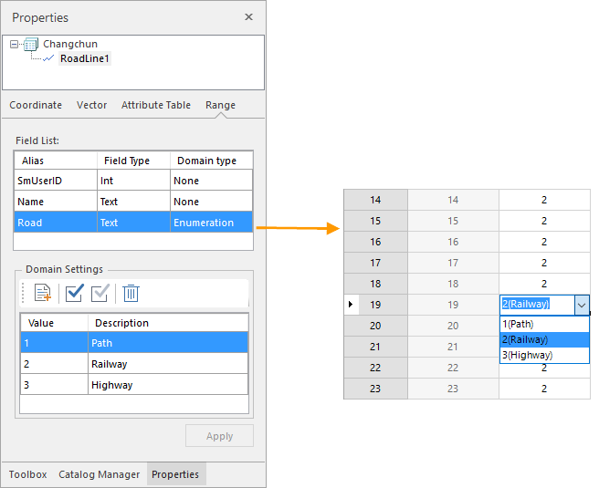
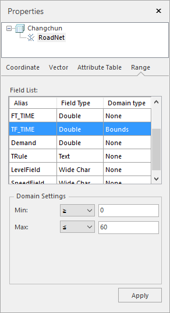

---
id: DTgroupDiaVector
title: Properties of Vector Dataset  
---  
If one or more vector datasets are selected in the workspace manager, the
content displayed in the Properties panel include: Dataset, Coordinate,
Vector, Attribute Table, and Domain

### Dataset

The panel Dataset displays the attribute information of the dataset including the basic information, bounds information, and the detailed description.

**Basic info:**

  * **Name** : The dataset name.
  * **Type** : The dataset type.
  * **Table Name** : The name of the attribute table of the dataset.
  * **Encode** : The encoding mode of the vector dataset. For more information on different encoding modes, please refer to [Encoding Modes for Dataset Compression](EncodeType).

**Dataset Bounds:**

  * Left, Bottom, Right, and Top: The bounds of the vector dataset. The unit of 4 values is the same as the dataset. You are allowed to recalculate, copy, and paste the bounds. 
* **Recalculate** : recalculates the bounds of the dataset according to the spatial position of its objects. For specific information, please refer to [Recomputing Bounds for Vector Datasets](DTv_Recalculate)
* **Copy and Paste** : copies the bounds of the dataset or pastes bounds as the bounds of the bounds.

**Description** : displays the descriptive information of the vector dataset. You can modify the description of the dataset.

### Coordinate

The coordinate system information of the vector dataset is displayed in the panel Coordinate.

  * **Coordinate System** : The name of the coordinate system employed by the vector dataset.
  * **Unit** : The distance unit of the vector dataset.
  * **Coordinate System Information** : The specific information of the coordinate system used by the vector dataset.

The function of the button at the toolbar of the coordinate system information:

  * **Reset Coordinate System** : Click this button to open the drop-down list where you can select a coordinate system or click "More"to select other coordinate systems. For specific setup methods, see the [Projection Settings](../projection/PrjCoordSysSettingWin). 
  * **Copy Coordinate System** : copies the coordinate system of a datasource or a dataset as the projection information of the current dataset. The system provides two ways to copy a coordinate system: 
* Copying the coordinate system information of a datasource in the current workspace.
* Copying the coordinate system information of a dataset in the current workspace.
  * **Export Coordinate System** : exports the coordiante system of as a projection information file (* .xml).
  * **Import Coordinate System** : imports a projection information file (*.xml) as the coordinate system of your dataset.
  * **Projection Transformation** : converts the coordinate system of the selected dataset from one to another. For specific setup methods, see [Projection Conversion](../projection/ConvertPrjCoordSys).

### Vector

The panel Vector displays the information of the vector dataset.

**Vector Dataset**

  * **Records** : The total number of objects of the vector dataset. 
  * **Charset** : The charset employed by the vector dataset. You can change the charset for the vector dataset by clicking the drop-down arrow and selecting a charset from the list. For more information on all supported charsets, please refer to [Charset List](Charset).
  * **Index Type** : The spatial index type of the vector dataset. For more information on different types of spatial indexes, please refer to [Spatial Index Types](SpatialIndexType).
  * **Read-only** : Whether the vector dataset is read-only or not. If this box is checked, the vector dataset cannot be edited.
  * **User Cache** : Whether the caching mechanism is employed or not. The checkbox is active only for the dataset with a tile index from the Oracle Plus-based datasource.
  * **Clear** : empty cache files.

**Tolerances:**

  * **Fuzzy** : The minimum distance between two vertices. The application will merge the two vertices that the minimum distance between them is less than the value. The unit is the same as the dataset. 
  * **Overshoot** : Displays and sets the tolerance of overshoot of the selected vector dataset. Any dangles shorter than this value are recognized as overshoots and can be removed in the topology processing. The unit is the same as the dataset. 
  * **Undershoot** : Displays and sets the tolerance of the undershoot of the selected vector dataset. Any dangles whose distances to another line or arc that they can extended to intersect with are smaller than this tolerance are recognized as undershoots and can be extended to intersect with another line/arc in the topology processing. The unit is the same as the dataset. 
  * **Grain** : The controlled distance between vertices when adding circles, arcs and curves. The unit is the same as the dataset.
  * **Sliver Polygon** : The smallest polygon in the vector dataset. During the topological processing, polygons smaller than the specified value are marked as sliver polygon. You can set to delete sliver polygons during the topological processing. The unit for Sliver Polygon is the same as the area unit of the vector dataset.

### Attribute Table

The panel Attribute Table displays the attribute table structure of your vector dataset in the form of a table.

Each row denotes information of a field of the attribute table of the selected dataset. Each column indicates a kind of information.

  * **No.** : The field number. 
  * **Name** : The field name, which is set during creation and cannot be modified after creation.
  * **Alias** : The alias of the field. The field alias is used for display in the attribute table.
  * **Type** : The type of a field. When adding a new field, you can specify the field type by clicking the drop-down arrow in the corresponding cell and selecting a type from the list. For datasets that saved in database-based datasources, the application supports modifying types of fields from 6 databases including PostgreSQL, OraclePlus, SQLServer, DMPlus, MySQL, and PostGIS. Please refer to the page [Field Type](DTgroupDiaVector_ModifyType) to check the supportive information on field types.
  * **Length** : The maximum length of the field. Only when you are creating a text field, you can modify the maximum length of the field.
  * **Default** : The default value of the field. When adding a new field, you can specify the default value by typing in the corresponding cell.
  * **Required** : Whether a field can contain a null value. When adding a new field, you can specify whether the field is required or not.

* You can manage all fields with buttons in the toolbar.

  * **Add icon** : Add a new field.
  * **Modify icon** : Edit the unit by selecting it first and then clicking Modify icon or double clicking it. 

For file-based datasources, only the field name, field type, default value, and Required of a non-system field can be changed.

* All of the field information of datasets are not allowed to change except field aliases.
* Each field name must be unique while the field aliases can be the same.
  * **Move Up/Down** : Adjusts the order of fields in the attribute table.
  * **Delete** : Delete the selected fields. When deleting one or more selected fields, the delete warning will pop up to confirm if you want to delete the selected field. Click OK to confirm the deletion. 
  * **Hyperlink** : set a text-type field or a wide character type field to a hyperlink field. For specific information, please refer to [Hyperlink](../../Visualization/BrowseMap/Hyperlink).
  * **Apply icon** : Apply all changes to the attribute table of the vector dataset. 

###  Domain

The panel Domain shows the domain information of the current dataset including Alias, Field Type, Domain Type, and Domain Settings.

The Field list section shows the field alias, field type, and domain type.

  * **Domain Type:** : displays and sets the domain type of each field excluding the system fields. Double click on the Domain Type item of your field to open the drop-down list where you can specify a domain type. If your field is numerical, its domain type can be Enumeration, Bounds, or None. Else its domain type can be Enumeration or None.
* **Enumeration** : If you set the domain type as enumeration, you can set the enumeration values in the "Domain Settings" text area and description information of every enumeration value. After that, when you edit field values in an attribute table, you can choose an enumeration value.  

  

* **Bounds** : If you set the domain type for a numeric field to Range, you can set the maximum and minimum value for the field.  
  

* **None** : No domain will be set.

**Note** : For a field with a domain, you will get an error prompt message if the value you entered is out of the domain.

* After setting the domain, click " **Apply** " to finalize the setting. 

###  Remark

If the field type is binary, the length of the field is invalid.
