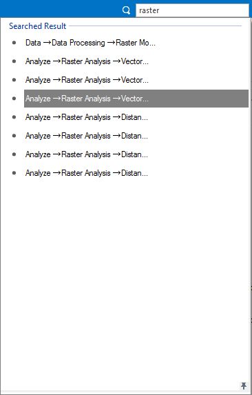

---
id: FeatureSearch
title: Function Search  
---  
The application provides rich GIS data processing functions. To help you access the feature you want quickly,  provides the "Function Search" tool. "Function Search" is global. The feature can find out all relevant features in the visible tabs. The result contains the tab name, the group name, and the function name.

**Note** : it searches features from the currently visible tabs. Hence, for features which are located in the invisible tabs in the current interface, it will pop up that the function you search doesn't exist.

### Search by name or keywords

The Function Search tool locates on the right corner of the application. You can directly enter the feature's name or keywords. The searching result is as follows:

  
  
The searching result is like above. If users have used the functions in the searching result, the functions will also be displayed in the Recent Use group. Click a function in the result list to open relevant dialog, or press Up or Bottom key to select a function, press Enter to open relevant dialog. It also supports inputting texts to locate the function.

**Note** : The prompt that the current item is not available means that the feature is active when there is corresponding data being opened. For example, to use the feature DEM Cut, you should open DEM data first.

