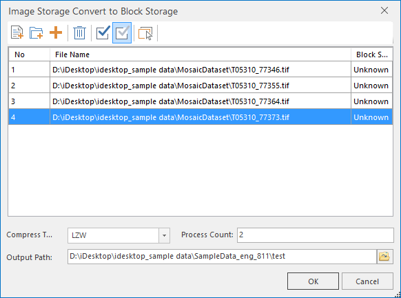
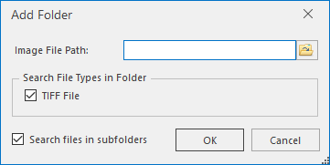

### Introduction

Converting image data to block storage can improve the speed of loading and browsing image data. It is mainly used for data processing of mosaic dataset to optimize data processing efficiency.  can convert image data into block storage and saved to the appropriate file.

### Basic Steps

  1. On the Data tab, in the Data Processing group, click the Image Storage Conversion button in the gallery to display the dialog box as shown below.
  
---  
Fig. Dialog box for converting imagery into block storage  
  2. In the dialog box, you can add a single file, or files in batch. 
    * Click the  button to add specified imagery file (*.tif, *tiff) to the list area.
    * Click the  button to add all the image files under the specified folder.

Click the **Add Folder** button to open the **Add Folder** dialog box as shown in the figure below. You can integratedly set the path of the folders, the types of image files, and whether to search the files in the sub-folder for their unified settings. The format of image files only can be TIFF.
  
---  
Fig. Add Folder dialog box  
  
  3. Set the Encoding type. 3 types are provided: None, JPEG, LZE. Please refer to [Dataset Encoding Types](../DataManagement/EncodeType.htm) for details.
  4. Set the number of processes: Proper processes can enhance the conversion efficiency. The default value is 2. You can optimize the value according to the computer configuration and running status.
  5. Set output path: Click the button to the right of the combox box, and specify the output path of the file, or you can directly input the output path in the text box.
  6. When finished, click OK to implement the conversion for files in the list area.

### Related Topics

 [Image Storage Conversion](ImageStorageConversion.htm)

  

