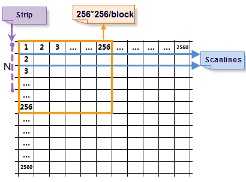

### Theory

Image storage modes contain scanning line storage, stripe storage, and block storage. The read modes are different according to the different storage modes.

* Scanning line: The system reads on row at a time.
* Stripe storage: The system reads N rows according to the specified stripe width N.
* Block storage: The system reads N blocks according to the specified block number N.

Here we take reading image at 2560*2560 as an example.

* Scanning line: The system will read 2560 times, and each time the size of the data read is 1*2560.
* Stripe storage: The system will read 2560/N times, and each time the size of the data read is 2560*N. The greater N is, the more memory will be used. The memory used will affect the read speed.
* Block storage: The image will be divided into 100 blocks at the size of 256*256. The system needs to read 100 times at most, and each time the size of data read is 256*256, which decrease the display time and enhance the read efficiency. Compared with the above two modes, block storage is a better way for storage.

Converting image data to block storage can improve the speed of loading and browsing image data. It is mainly used for data processing of mosaic dataset to optimize data processing efficiency.can convert image data into block storage and save to the appropriate file.

### Function Entrance

Data > Data Processing > Image Storage Conversion button in the gallery.

### Parameter Description

* iDesktop provides three ways to add image data including Select File, Select Folder, and Add List.
* **Check that the image is stored as blocks** : check whether your image has been stored as blocks. The result will be displayed in the column Block Storage.](../../TechDocument/SDX/AboutOracleSpatial)
* **Compress Type** : The parameter has three values including None, JPEG, and LZW. Please refer to [Dataset Encoding Types](../DataManagement/EncodeType) to get much specific information on the selection of encoding type.
* **Tasks** : Reasonable number of tasks can improve the storage conversion. 2 is by default. You can set an appropriate number according to your data size and available processes.

