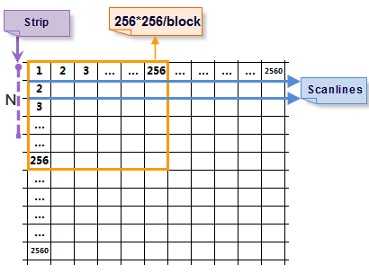

Image storage modes contain scanning line storage, stripe storage, and block storage. The read modes are different according to the different storage modes.

  * Scanning line: The system reads on row at a time.
  * Stripe storage: The system reads N rows according to the specified stripe width N.
  * Block storage: The system reads N blocks according to the specified block number N.

Here we take reading image at 2560*2560 as an example.

  * Scanning line: The system will read 2560 times, and each time the size of the data read is 1*2560.
  * Stripe storage: The system will read 2560/N times, and each time the size of the data read is 2560*N. The greater N is, the more memory will be used. The memory used will affect the read speed.
  * Block storage: The image will be divided into 100 blocks at the size of 256*256. The system needs to read 100 times at most, and each time the size of data read is 256*256, which decrease the display time and enhance the read efficiency. Compared with the above two modes, block storage is a better way for storage.

  
---  
Fig. 2560*2560 imagery  
  
**Primary contents for image storage conversion:**

  [Convert Image to Block Storage](ImageConvertToBlock.htm)

