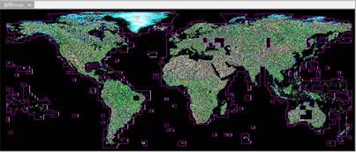
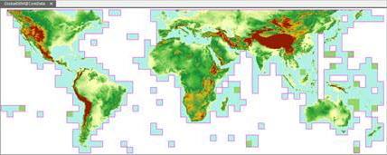

---
id: MosaicDataset
title: Mosaic Dataset  
---  
Before producing the mosaic dataset function, if you wanted to manage and display massive data in SuperMap products, all of the data needed to be added into a library, which was very time-consuming and occupied space on your disk. And to make the display performance more better, you must create image pyramid for image data, which is another very time-consuming task. And now, you can manage all of your image by creating a mosaic dataset, it manages images in the way meta data with the paths of original image files. Only some meta information of images can be recorded when you add images into a mosaic dataset, such as paths, outlines, resolutions, etc., when you use your mosaic dataset, the system will add the necessary images according the meta information. The scheme greatly increases efficiency in speed of adding images and largely reduces the occupation of your disk.

### The advantages of mosaic dataset

  * It is used to manage data in raster formats(.tif, .tiff, .img). Data in different formats can be added into the same mosaic dataset, and you can add massive data at a time.
  * The coordinate systems of images added into the same mosaic dataset may be different, to make them tiled display dynamically, it is required to set a uniform geographical coordinate. 
  
 
  * The high efficiency of adding images and the less disk occupied. We did a test, and the test result indicates that: for global DEM data at the resolution of 30 meter, a total of 22667 images and the size of them was 0.98TB. Importing all of them into a UDB datasource took 14 minutes with the udb size is 16MB and the udd size is 22MB.  
  

### Related topics

 [Manage a mosaic dataset](MosaicDataManagement)

 [Display a mosaic dataset](MosaicDatasetView)

 [Create a mosaic dataset](CreateMosaicDataset)