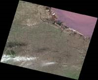

A series of features are provided for mosaic dataset management. Below content details each feature.

### Browse Attributes

Right-click your mosaic dataset and select "Browse Footprint Attributes" to open the attribute table which is the attribute table of the footprint data actually. Of which, every record matches an footprint object. Primary fields of the attribute table:

* **SmFileName** : The file names (extension excluded) of all original image files managed in the mosaic dataset, as well as the file names of overviews(extension included).
* **SmPath** : The full path (absolute path) of all original image files that are added to the mosaic dataset and the full path of every overview file. The paths support the network sharing paths. Therefore, you can realize the shared use of the mosaic dataset by editing this field .
* **SmCategory** : To identify whether the currently displayed image is the original data or overviews. 1 means displaying the original data. 2 denotes displaying the overviews. 
* **SmMinPS** : Defines the lowest resolution of the image that can be accessed. The default value is 0. If a request requests images below he specified minimum resolution, the request fails and the images will not be returned. 
* **SmMaxPS** : Defines the highest resolution of the image that can be accessed. The default value is 0. If a request requests images greater than the specified maximum resolution, the request fails and gray images will be returned. 
* **SmMinPS** and **SmMaxPS** : SmMinPs and SmMaxPs define the size range of the pixels. The settings determine at which resolution the mosaic image data will display. The system calculates SmMinPs and SmMaxPs values based on the overlay between the image pyramid and the images. 
* **SmLowPS** and **SmHighPS** define the actual range of pixel size contained in a raster dataset, with SmLowPS indicating the real resolution of the image, and SmHighPS indicating the image pyramid resolution of the image. 

### Add Data

After creating the dataset, you can continue to add .tif, .tiff, .img files to this dataset. The specific operations are as follows:

**Function Entrances**

Right-click your mosaic dataset and select "Add Image Data..." to open the dialog box "Add Mosaic Data" where you can add new images. You can add a single file, or files through importing a folder, or a folder list.

### Create Image Pyramid

To improve the display effects of a lot of image data, you can create a pyramid for your data. The program will create multiple levels of pyramids as a rule to make the pyramid image with relative resolution display in different scales. When creating overviews, pyramids are needed for all images in your mosaic dataset.

**Function Entrances**

Right-click your mosaic dataset and select Build Image Pyramid.

**Parameter Description** : sets parameters on the creation of image pyramids.

* The application provides the following methods for data re-sampling. For details, please refer to [Raster Coding Types](../../DataProcessing/DataManagement/EncodeType)
* **Nearest** : Take the most adjacent pixel values of input raster dataset as input values to assign the relative pixels of output raster dataset.
* **Average** : Re-sample by calculating the average of all valid values.
* **Gauss Kernel Calculation** : Re-sample in the way of Gauss Kernel Calculation. For the kinds of images with high contrast and image boundaries, the re-sampling way are better.
* **Average Complex Data** Averages complex data in magphase space.
* **Encoding Type** : the application provides three encoding types including **DEFLATE** , **JPEG** , and **LZW**.](ImportModelData)
* **Tasks** : Set the number of threads of execution to create image pyramids.

### Build Overviews

To make the display effect of mosaic dataset better, only footprint will be shown in smaller scales by default.

**Function Entrance**

Right click your mosaic dataset and select "Build Overview...".

**Parameter Description** : set the maximum width, maximum height, sample tolerance, and output path.

* **Max Width and Height** : Set the maximum width and height of overviews.
* **Sample Tolerance** : The resolution ratio between two adjacent levels of overviews.
* **Output Path** : The storage paths of overview files.
* **Remove** : Some black boundaries may appear because of the overlaps between the novalue areas and the normal area. Hence, you can specify a value for non-value areas to display data normally.

* **Multi-tasking** : Creating overviews using multiple processes to improve the creation speed. Please set a proper number according to the computer configuration and process usage.

* Building overviews for mosaic datasets is actually a reconstruction of the multi-layer pyramids according to some rules for the original image. After the overview is built, the mosaic dataset can be shown at a small scale and image files are generated and saved under the overview output path. Related records will be added into the footprint attribute table.

### Reassign Path

Re-specify the paths of the original image files or the paths of overviews.

**Function Entrances**

Right-click your mosaic dataset, and select "Reassign Path..." to open the "Reassign Image Data" dialog box where you can modify the paths of original files and overviews' paths.

**Parameter Descritpion**

* **The path of original image** : If the original image has been moved, to call it, you can reset its path.
* **The path of overviews** : Update the storage path of overviews.

### Clear Data

**Function Entrances**

Right-click your mosaic dataset and select "Clear Data..." to open the "Clear Data" dialog box.

You can select to remove all records or only remove overviews from the mosaic dataset.

### Rebuild Bounds

If some changes happen in your mosaic dataset, you can rebuild the range of your mosaic dataset by clicking the function. For more details, please refer to [Image map configuration - rebuild data range](MosaicDatasetView.).

**Function Entrances**

Right click your mosaic dataset and select "Rebuild Bound" to open the dialog box "Rebuild Bounds".

**Parameter Description**

There are three options provided for rebuilding bounds in the dialog box.

* **Rebuild Footprint** : You are allowed to rebuild footprint.
* **Rebuild Boundary** : Rebuild the boundaries of your mosaic dataset. Two ways are provided including: 
* **Select Dataset Bounds** : Choose a region dataset to rebuild bounds.
* **Custom Bounds** : Set up bounds through drawing bounds or selecting objects.
* **Rebuild Clip Bound** : You are allowed to rebuild clipping bounds.
* **Use Footprint Bound** : build the clip area based on the footprint of image data and update it to the clip dataset. 

**Clip Offset** : if there are some NoValue areas falling into the borders of the clip area, you can specify a clip offset to make the clip area smaller than the footprint.

* **Auto Calculation of Clip Bounds**

The valid areas of image data can be regularly shaped like the parallelogram shown below and irregularly shaped.

 | 
---|---
Figure: the valid area of image data is a convex polygon | Figure: the valid area of image data is irregularly shaped

Before performing the automatic calculation of clip bounds, some settings of parameters are a must.

For irregular shaped area, you are required to check **Complex Polygon**. But for irregular shaped area, it doesn't matter to check **Complex Polygon** or not.

The parameter **Exact Clip** will calculate the clip area based on the original image data, which is much accurate. If you don't select the item, the accuracy of the resulting data is not very high. However, the calculation is performed based on image pyramids, and so it is very fast.

When extracting the valid borders of image data, the areas with NoValue cells will be taken as valid areas. If you set the tolerance to any value, not 0, the cells close to the NoValue cells in the tolerance range will be taken as NoValue cells. Therefore, setting a proper tolerance can remove some invalid cells.

Besides, checking the **Complex Polygon** box can still get the correct results for convex polygon shaped areas.
<table class=MsoNormalTable border=1 cellspacing=0 cellpadding=0
 style='border-collapse:collapse;border:none'>
 <tr style='height:20.8pt'>
  <td width=199 style='width:149.5pt;border:solid #BFBFBF 1.0pt;background:
  #F2F2F2;padding:0cm 5.4pt 0cm 5.4pt;height:20.8pt'>
  
<b>Original image files</b>

  </td>
  <td width=187 style='width:140.4pt;border:solid #BFBFBF 1.0pt;border-left:
  none;background:#F2F2F2;padding:0cm 5.4pt 0cm 5.4pt;height:20.8pt'>
  
<b>The automatic calculation results</b>

  </td>
  <td width=206 colspan=2 style='width:154.7pt;border:solid #BFBFBF 1.0pt;
  border-left:none;background:#F2F2F2;padding:0cm 5.4pt 0cm 5.4pt;height:20.8pt'>
  
<b>Supported or not</b>

  </td>
 </tr>
 <tr style='height:56.4pt'>
  <td width=199 rowspan=2 valign=top style='width:149.5pt;border:solid #BFBFBF 1.0pt;
  border-top:none;padding:0cm 5.4pt 0cm 5.4pt;height:56.4pt'>
  

  
3 bands 8 bit unsigned IMG image

  
NoValue: 0

  </td>
  <td width=187 rowspan=2 valign=top style='width:140.4pt;border-top:none;
  border-left:none;border-bottom:solid #BFBFBF 1.0pt;border-right:solid #BFBFBF 1.0pt;
  padding:0cm 5.4pt 0cm 5.4pt;height:56.4pt'>
  

  </td>
  <td width=103 style='width:77.5pt;border-top:none;border-left:none;
  border-bottom:solid #BFBFBF 1.0pt;border-right:solid #BFBFBF 1.0pt;
  padding:0cm 5.4pt 0cm 5.4pt;height:56.4pt'>
  
Calculate based on source images

  </td>
  <td width=103 style='width:77.2pt;border-top:none;border-left:none;
  border-bottom:solid #BFBFBF 1.0pt;border-right:solid #BFBFBF 1.0pt;
  padding:0cm 5.4pt 0cm 5.4pt;height:56.4pt'>
  
<b>v</b>

  </td>
 </tr>
 <tr>
  <td width=103 style='width:77.5pt;border-top:none;border-left:none;
  border-bottom:solid #BFBFBF 1.0pt;border-right:solid #BFBFBF 1.0pt;
  padding:0cm 5.4pt 0cm 5.4pt'>
  
Calculate based on image pyramids

  </td>
  <td width=103 style='width:77.2pt;border-top:none;border-left:none;
  border-bottom:solid #BFBFBF 1.0pt;border-right:solid #BFBFBF 1.0pt;
  padding:0cm 5.4pt 0cm 5.4pt'>
  
<b>v</b>

  </td>
 </tr>
 <tr style='height:88.4pt'>
  <td width=199 rowspan=2 valign=top style='width:149.5pt;border:solid #BFBFBF 1.0pt;
  border-top:none;padding:0cm 5.4pt 0cm 5.4pt;height:88.4pt'>
  

  
3 bands 8 bit unsigned IMG image

  
NoValue: 0

  </td>
  <td width=187 rowspan=2 valign=top style='width:140.4pt;border-top:none;
  border-left:none;border-bottom:solid #BFBFBF 1.0pt;border-right:solid #BFBFBF 1.0pt;
  padding:0cm 5.4pt 0cm 5.4pt;height:88.4pt'>
  

  </td>
  <td width=103 style='width:77.5pt;border-top:none;border-left:none;
  border-bottom:solid #BFBFBF 1.0pt;border-right:solid #BFBFBF 1.0pt;
  padding:0cm 5.4pt 0cm 5.4pt;height:88.4pt'>
  
Calculate based on source images

  </td>
  <td width=103 style='width:77.2pt;border-top:none;border-left:none;
  border-bottom:solid #BFBFBF 1.0pt;border-right:solid #BFBFBF 1.0pt;
  padding:0cm 5.4pt 0cm 5.4pt;height:88.4pt'>
  
<b>v</b>

  </td>
 </tr>
 <tr>
  <td width=103 style='width:77.5pt;border-top:none;border-left:none;
  border-bottom:solid #BFBFBF 1.0pt;border-right:solid #BFBFBF 1.0pt;
  padding:0cm 5.4pt 0cm 5.4pt'>
  
Calculate based on image pyramids

  </td>
  <td width=103 style='width:77.2pt;border-top:none;border-left:none;
  border-bottom:solid #BFBFBF 1.0pt;border-right:solid #BFBFBF 1.0pt;
  padding:0cm 5.4pt 0cm 5.4pt'>
  
<b>v</b>

  </td>
 </tr>
 <tr style='height:71.8pt'>
  <td width=199 rowspan=2 valign=top style='width:149.5pt;border:solid #BFBFBF 1.0pt;
  border-top:none;padding:0cm 5.4pt 0cm 5.4pt;height:71.8pt'>
  

  
Single band 8 bit unsigned IMG image

  
NoValue: 0

  </td>
  <td width=187 rowspan=2 valign=top style='width:140.4pt;border-top:none;
  border-left:none;border-bottom:solid #BFBFBF 1.0pt;border-right:solid #BFBFBF 1.0pt;
  padding:0cm 5.4pt 0cm 5.4pt;height:71.8pt'>
  

  </td>
  <td width=103 style='width:77.5pt;border-top:none;border-left:none;
  border-bottom:solid #BFBFBF 1.0pt;border-right:solid #BFBFBF 1.0pt;
  padding:0cm 5.4pt 0cm 5.4pt;height:71.8pt'>
  
Calculate based on source images

  </td>
  <td width=103 style='width:77.2pt;border-top:none;border-left:none;
  border-bottom:solid #BFBFBF 1.0pt;border-right:solid #BFBFBF 1.0pt;
  padding:0cm 5.4pt 0cm 5.4pt;height:71.8pt'>
  
<b>v</b>

  </td>
 </tr>
 <tr>
  <td width=103 style='width:77.5pt;border-top:none;border-left:none;
  border-bottom:solid #BFBFBF 1.0pt;border-right:solid #BFBFBF 1.0pt;
  padding:0cm 5.4pt 0cm 5.4pt'>
  
Calculate based on image pyramids

  </td>
  <td width=103 style='width:77.2pt;border-top:none;border-left:none;
  border-bottom:solid #BFBFBF 1.0pt;border-right:solid #BFBFBF 1.0pt;
  padding:0cm 5.4pt 0cm 5.4pt'>
  
<b>v</b>

  </td>
 </tr>
 <tr style='height:77.35pt'>
  <td width=199 rowspan=2 valign=top style='width:149.5pt;border:solid #BFBFBF 1.0pt;
  border-top:none;padding:0cm 5.4pt 0cm 5.4pt;height:77.35pt'>
  

  
3 bands 8 bit unsigned IMG image

  
NoValue: 0

  </td>
  <td width=187 rowspan=2 valign=top style='width:140.4pt;border-top:none;
  border-left:none;border-bottom:solid #BFBFBF 1.0pt;border-right:solid #BFBFBF 1.0pt;
  padding:0cm 5.4pt 0cm 5.4pt;height:77.35pt'>
  

  </td>
  <td width=103 style='width:77.5pt;border-top:none;border-left:none;
  border-bottom:solid #BFBFBF 1.0pt;border-right:solid #BFBFBF 1.0pt;
  padding:0cm 5.4pt 0cm 5.4pt;height:77.35pt'>
  
Calculate based on source images

  </td>
  <td width=103 style='width:77.2pt;border-top:none;border-left:none;
  border-bottom:solid #BFBFBF 1.0pt;border-right:solid #BFBFBF 1.0pt;
  padding:0cm 5.4pt 0cm 5.4pt;height:77.35pt'>
  
<b>v</b>

  </td>
 </tr>
 <tr>
  <td width=103 style='width:77.5pt;border-top:none;border-left:none;
  border-bottom:solid #BFBFBF 1.0pt;border-right:solid #BFBFBF 1.0pt;
  padding:0cm 5.4pt 0cm 5.4pt'>
  
Calculate based on image pyramids

  </td>
  <td width=103 style='width:77.2pt;border-top:none;border-left:none;
  border-bottom:solid #BFBFBF 1.0pt;border-right:solid #BFBFBF 1.0pt;
  padding:0cm 5.4pt 0cm 5.4pt'>
  
<b>v</b>

  </td>
 </tr>
 <tr style='height:161.05pt'>
  <td width=199 rowspan=2 valign=top style='width:149.5pt;border:solid #BFBFBF 1.0pt;
  border-top:none;padding:0cm 5.4pt 0cm 5.4pt;height:161.05pt'>
  

  
7 bands 8 bit unsigned TIFF image

  
coordinate system: EPSG:4326

  
Image size: 238M

  
NoValue: 255

  
Special cells of valid areas of image data: 

  
[1]
  Similar to an enclave, the area connects with the main area by one cell. 

  

  
[2]
  An enclave doesn't connect with the main area.

  

  
&nbsp;

  
&nbsp;

  </td>
  <td width=187 rowspan=2 valign=top style='width:140.4pt;border-top:none;
  border-left:none;border-bottom:solid #BFBFBF 1.0pt;border-right:solid #BFBFBF 1.0pt;
  padding:0cm 5.4pt 0cm 5.4pt;height:161.05pt'>
  

  
&nbsp;

  

  
The result is correct.

  
&nbsp;

  

  
The area of the enclave is too small to involve in the calculation. Therefore, the result data doesn't include the area.

  </td>
  <td width=103 style='width:77.5pt;border-top:none;border-left:none;
  border-bottom:solid #BFBFBF 1.0pt;border-right:solid #BFBFBF 1.0pt;
  padding:0cm 5.4pt 0cm 5.4pt;height:161.05pt'>
  
Calculate based on source images

  </td>
  <td width=103 style='width:77.2pt;border-top:none;border-left:none;
  border-bottom:solid #BFBFBF 1.0pt;border-right:solid #BFBFBF 1.0pt;
  padding:0cm 5.4pt 0cm 5.4pt;height:161.05pt'>
  
<b>v</b>

  </td>
 </tr>
 <tr>
  <td width=103 style='width:77.5pt;border-top:none;border-left:none;
  border-bottom:solid #BFBFBF 1.0pt;border-right:solid #BFBFBF 1.0pt;
  padding:0cm 5.4pt 0cm 5.4pt'>
  
Calculate based on image pyramids

  </td>
  <td width=103 style='width:77.2pt;border-top:none;border-left:none;
  border-bottom:solid #BFBFBF 1.0pt;border-right:solid #BFBFBF 1.0pt;
  padding:0cm 5.4pt 0cm 5.4pt'>
  
<b>v</b>

  </td>
 </tr>
 <tr style='height:127.1pt'>
  <td width=199 rowspan=2 valign=top style='width:149.5pt;border:solid #BFBFBF 1.0pt;
  border-top:none;padding:0cm 5.4pt 0cm 5.4pt;height:127.1pt'>
  

  

  
3 bands 8 bit unsigned  TIFF image

  
NoValue: not unique, including neighbor values in the tolerance range.

  </td>
  <td width=187 style='width:140.4pt;border-top:none;border-left:none;
  border-bottom:solid #BFBFBF 1.0pt;border-right:solid #BFBFBF 1.0pt;
  padding:0cm 5.4pt 0cm 5.4pt;height:127.1pt'>
  

  Doesn't support the automatical calculation of valid areas of image data that has multiple NoValues.

  </td>
  <td width=103 style='width:77.5pt;border-top:none;border-left:none;
  border-bottom:solid #BFBFBF 1.0pt;border-right:solid #BFBFBF 1.0pt;
  padding:0cm 5.4pt 0cm 5.4pt;height:127.1pt'>
  
Calculate based on source images

  </td>
  <td width=103 style='width:77.2pt;border-top:none;border-left:none;
  border-bottom:solid #BFBFBF 1.0pt;border-right:solid #BFBFBF 1.0pt;
  padding:0cm 5.4pt 0cm 5.4pt;height:127.1pt'>
  
<b>--</b>

  
<b>&nbsp;</b>

  </td>
 </tr>
 <tr>
  <td width=187 valign=top style='width:140.4pt;border-top:none;border-left:
  none;border-bottom:solid #BFBFBF 1.0pt;border-right:solid #BFBFBF 1.0pt;
  padding:0cm 5.4pt 0cm 5.4pt'>
  
&nbsp;

  </td>
  <td width=103 style='width:77.5pt;border-top:none;border-left:none;
  border-bottom:solid #BFBFBF 1.0pt;border-right:solid #BFBFBF 1.0pt;
  padding:0cm 5.4pt 0cm 5.4pt'>
  
Calculate based on image pyramids

  </td>
  <td width=103 style='width:77.2pt;border-top:none;border-left:none;
  border-bottom:solid #BFBFBF 1.0pt;border-right:solid #BFBFBF 1.0pt;
  padding:0cm 5.4pt 0cm 5.4pt'>
  
<b>--</b>

  </td>
 </tr>
</table>

* **Read a clip file**

If each of your image has the corresponding clip area saving in the same named separate .shp file, you can adopt the function to clip image data.

Besides, when adding images to a mosaic dataset, the application allows you to update the entrance of a clip dataset by reading a clip file. For specific information, please refer to [Create Mosaic Dataset - Read Clip Bounds](CreateMosaicDataset). If no .shp files correspond with your image data, its footprint is the clip area by default.

The way of reading a clip file applies to the kind of images that have multiple NoValues.

After getting clip areas of images, you can use the clip areas to make the application display the valid areas of your images only by setting the **Clip Type** to **Data Clip** in the **Layer Properties** panel. For specific information, please refer to [Clip Visible Image](MosaicDatasetView).

**Note** : After rebuilding clip areas, you can consider whether to update the overview map according to your needs.

### Statistics Info

Statistics info prepares data for displaying your mosaic dataset in differently stretching ways. Statistics info is essential for the stretching way setting.

**Function Entrances**

* Right click your mosaic dataset and select "Statistic Info". And then the application will count the maximum value, minimum value, average, standard deviation, and variance of images one by one.

### Export Data

**Function Entrance**

* Right-click your mosaic dataset and select "Export Data..." to open the "Export Mosaic Data" dialog box. 

**Parameter Description** : To export a file or a file list, please set the following parameters:

* **Bounds Settings** : Set the bounds of file or file list you want to export. Four ways are supplied for the settings of bounds: Whole (the whole map), Draw Range (draw a range in the map window), Select Object (select one or more objects as the range), and Copy/Paste (an existed coordinate value). The Select Object can be worked unless there is at least one region dataset, and for the Draw Range feature, the mosaic dataset must be opened.
* **Parameter Settings** : Set what kinds of files will be exported: overviews or image data or both of them.
* **Save Result** : Set the output path of data. 
* **Save as Dataset** : Export your mosaic dataset as a new dataset and save it to a datasource.

### Update Image File List

When data in your mosaic dataset changes, such as you deleted some images, added some images, or moved the images, you need to update your mosaic dataset through the following features.

* **Add mosaic data** : Add new image files into your mosaic dataset.
* **Build Overview** : Rebuild overviews.
* **Reassign Path** : Modify the paths of original image files or overviews.
* **Clear Data** : Delete the image file list but keeping overviews or empty your mosaic dataset.
* **Rebuild Bounds** : When adding or deleting some image files, you can click the feature to update the boundaries of your mosaic dataset.

### Related Topics

 [Mosaic dataset overview](MosaicDataset)

 [Mosaic dataset display](MosaicDatasetView)

 [Configure image map based on a mosaic dataset](MosaicDatasetMapConfig)

 [Create a mosaic dataset](CreateMosaicDataset)

