---
id: MosaicDatasetView
title: Display Mosaic Dataset  
---  
Adding the mosaic dataset to a map window, the application will show the
footprint of your mosaic dataset which contains a huge amount of image data
without displaying any content until zooming the map to a big scale. The
mosaic dataset reads the images within the current display range and joints
them together dynamically. The first browse speed may be slow. But the system will create cache to improve the speed for your next browse.

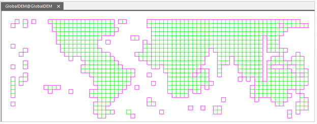  
  
When you want to view the full extent of your mosaic dataset after jointing
images, you can create an overview which can show the results in a small
scale. For descriptions on overviews, please consult [Manage Mosaic
Dataset](MosaicDatasetManage).

  
  
###  Remove NoValues

Besides, after correcting some remote sensing images, no-value areas appear
which have impact to the display efficiency. The no-value areas may be inside or outside of valid areas.

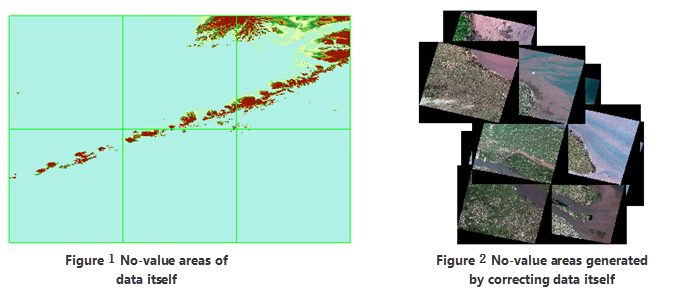  

  
The NoValue areas no matter generated by correcting images or existed in the
data self need removing. There are two choices to remove them:

  1. **NoValue Transparent** : In the layer manager, select the image layer then open the Layer Properties panel. Specify the no-value as the bands of the image, then check the No Value Transparent. 
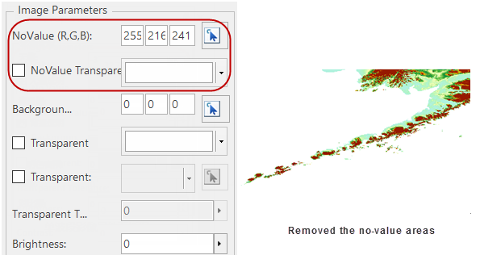  
 
  2. **Clip Image**

The clip area of your image data can be used to display its valid area only.
In the **Layer Properties** panel, check **Draw by File** and set **Clip
Type** to **Data Clip**. And then the application will use the clip dataset to control the display of your image data. 
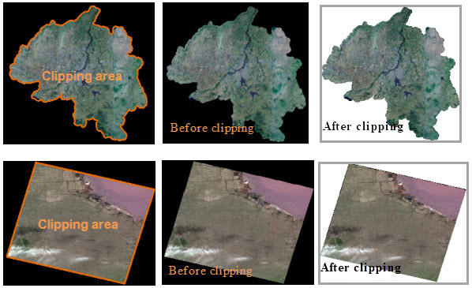  

###  The settings of display efficiency

The settings of display efficiency for images of mosaic dataset are similar to the settings for common images. The adjustments of displays contains: the special value display, the colortable display, the stretch display, or you can set a grid function to get the 3D Hillshade Map and Ortho image efficiency. All the settings can be done on the Layer Properties panel.

  * **The display of special value** : You can specify the area with a special value transparent or display them with a special color.  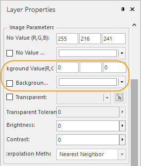  

  * **Colortable display** : You can use the color table to display the elevation grading of DEM data. 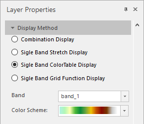  

  * **Stretch display** : With the feature, images can be shown clearer. And you can combine the Colortable Display to make images more beautiful.  
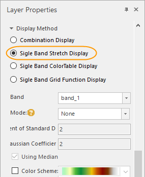  

  * **Grid function display** : When the mosaic dataset manage DEM data especially for large-scale data, with the Grid Function Display feature, you can quickly get the display efficiency of 3D hillshade map and ortho image. 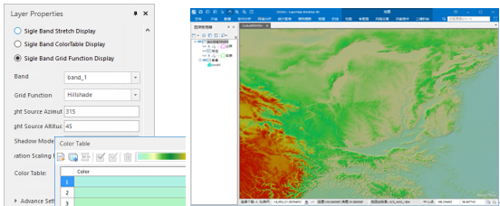  

###  The settings of display bounds

  * Construct a display filter expression to show parts of images in your mosaic dataset. 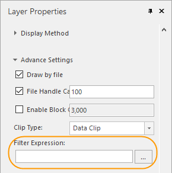  
  * You can quickly configure a country even global image map with thea mosaic dataset and also only parts of a mosaic dataset can be shown through the clip dataset. 
  * The Boundary dataset which is built based on the outlines controls the display bounds of mosaic dataset. Following pictures show how to rebuild boundaries. For example, you can rebuild the boundary of Hebei province based on the Hebei region dataset, also you can draw a polygon or select a region object in a map. 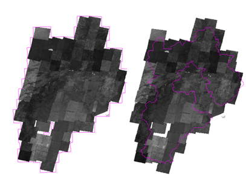  
  * In the Layer Properties panel, set the Clip Type to "Boundary Clip". 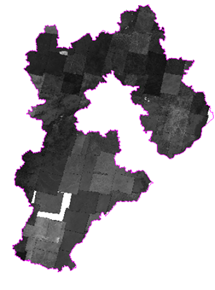  

### Display Order Settings

After opening a mosaic dataset, you can adjust the order of images displaying on the map by sorting a field of the Footprint dataset. For specific information on the object display order, please refer to [Object Display Order Field](../../Visualization/VisualSetting/Vectorgroup).

  

  
###  The optimization of display performance

To improve the display efficiency of the mosaic dataset, you can create image pyramids for all images managed in your mosaic dataset. For more details, please refer to [Manage the mosaic dataset](MosaicDatasetManage).

Saving your image data in blocks can improve the display efficiency as well. Click "Data" > "Data Processing" > "Raster" > "Image Storage Conversion" to open the "Save Image Using Block Storage" dialog box. Add the images you want and the compressing type and the path of outputs. You can specify how many processes will be executed to save them. For more details on converting the storage of images, please consult to [Image Storage Conversion](ImageStorageConversion).

### Related topics

 [An overview of the mosaic dataset](MosaicDataset)

 [Manage the mosaic dataset](MosaicDataManagement)

 [Create a mosaic dataset](CreateMosaicDataset)