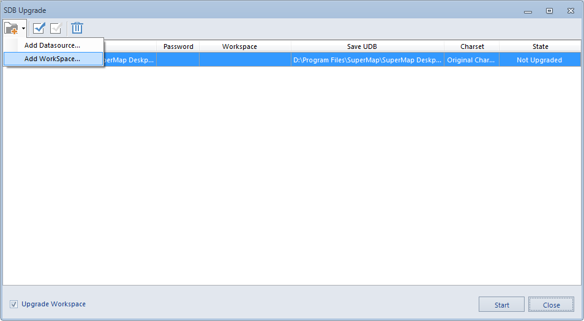
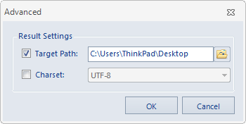

---
id: SDBUpdate
title: SDB Data Upgrade  
---  
### Introduction

SuperMap iDesktop 7C and above versions no longer supports SDB datasources. 
The function "SDB -> UDB " allows you to upgrade a SDB datasource to a UDB 
datasource so that the data can be opened in workspace of SuperMap iDesktop 7C 
and above versions. You can go to Data tab->Tools group-> Datasource 
Coversion-> SDB -> UDB button to upgrade SDB data; Also you can open the 
workspace which includes SDB datasource to finish upgrading.

### Basic Steps

  1. Open SDB upgrade dialog by clicking Tool tab->Data group->SDB upgrade button.
  2. In SDB upgrade dialog, click  drop-down button, select "Add datasource" or "Add workspace" option to add the data need to be upgraded. The datasource is added in the first row while the workspace is added in the second row.
  
Figure: SDB Upgrade  
    * SDB Datasource: Display the datasource name and location.
    * Password: If the added SDB datasource has already been set password, users need to input the password to upgrade datasource.
    * Workspace: If the added data is workspace, the option will be used for displaying the name and location of workspace.
    * Save UDB: Double click it to change the location for storing UDB datasource and the name.
    * Charset: Double click it to set the target charset includes "UTF-8" and "Original charset". "UTF-8" is for a variable-length Unicode character encoding, which can be used for representing any character in the Unicode standard. Users are suggested to choose UTF-8 charset as default.
    * Status: Tell users whehter the upgrade is finished or not. If the data is not upgraded, it displays "Not Upgraded". Otherwise, it displays "Success".
    * Upgrade Workspace: If the upgrade workspace check box is checked, the workspace will be upgraded together with the datasource. And it will generate a new workspace file which not replace the original workspace. For example, if the original workspace named "world.smwu", the upgraded one will be saved as "world_New.smwu" in the same location.
    * **Set All:** In the dialog box, select multiple "SDB datasources", and click the button, and in the popup dialog box, you can set the same parameters for all of the datasources.    
Figure: Set All  
  3. If the opened workspace has SDB datasource, users will be informed to upgrade SDB datasource automatically. Click Yes to upgrade and save the workspace as another one. Otherwise, it may lead to the loss of datasource connection so the datasource will not be opened. 

### Note

  * Only SDX+ for SDB engine will be supported for upgrade.
  * SDB datasource will not replace the original one after upgrading; Workspace has the sdb datasource will be saved as a new one after upgrading and also contains the udb datasource which is upgraded from the sdb datasource.

  

