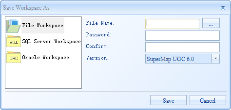

---
id: SaveWorkspace
title: Saving a Workspace  
---  
### Instructions

The Save command allows you to save the workspace and all operating results 
you have achieved to the workspace. To save your operating results for future 
use, you need to save those results to the workspace first, and then save the 
workspace.

### Basic Steps

  1. On the Start tab, in the Workspace group, click Save. The button is only active if there are unsaved changes in the workspace.
  2. The Save dialog box will pop up if there are unsaved changes to maps, scenes or layouts in the workspace. 
    * All unsaved items are listed in the Save dialog box. A checked box indicates all changes to the item will be saved, while an unchecked box indicates that all changes will be dropped.
    * The Rename command allows you to change the name of the map, layout, or scene.
    * The Select All and Inverse buttons are respectively used to select all items and the inverse items in the list.
    * Save KML layers in scenes: Check the box to save the KML layers in the scenes.
  3. Click Save to save the specified contents and close the dialog box.
  4. If the workspace is an existing one, it will be directly saved. If the workspace hasn't been saved before, you need to save it first through the Save Workspace As dialog box.
  5. Highlight the target type and set the necessary information.Figure: The Save Workspace As dialog box

File Workspace

  1. Click the Save button or the drop-down button, select Save As File... in the drop-down menu to save the currently open workspace as a new file-based workspace.
  2. Below is the dialog box for saving the workspace as a file workspace.
  
---  
Figure: The Workspace Save As dialog box  
    * File Name: You can click the button with the ellipse  to the right of the text box to display the Save Workspace As dialog box, in which you can specify the destination and name the new file workspace.

You can only save a workspace as a file workspace in either *.sxwu or *.smwu format.

    * Password: Set a password for the new workspace.
    * Confirm: Enter the password again.
  3. Click Save to save the workspace.

Oracle Workspace

  1. Click the Save button or the drop-down button, select Save As Oracle... in the drop-down menu to save the currently open workspace as a new Oracle workspace.
  2. Below is the dialog box for saving the workspace as an Oracle Workspace. 
    * Instance: The name of the Oracle database instance to which you want to connect. You can click the Instance drop-down arrow to display all instances you have connected before and select an instance from the list.
    * Database: The name of the Oracle database where the workspace you want to save is located.
    * User Name: The user name with the authority of accessing the Oracle database.
    * Password: The password for validation.
    * Workspace: The name of the new Oracle workspace. If you have correctly specified the instance, database, user name, and password, all Oracle workspaces in the specified database will be listed in the drop-down list.
  3. When finished, click Save to save the workspace to the specified Oracle database.

SQL Server Workspace

  1. Click the Save button or the drop-down button, select Save As SQL Server... in the drop-down menu to save the currently open workspace as a new SQL Server workspace.
  2. Below is the dialog box for saving the workspace as a SQL Server workspace. 
    * Server: The name of the server where the SQL Server database is located. You can click the Server drop-down arrow to display all servers you have connected before and select a server from the list.
    * Database: The name of the SQL Server database where the workspace you want to save is located.
    * User Name: The user name with the authority of accessing the Oracle database.
    * Password: The password for validation.
    * Workspace: The name of the new SQL Server workspace. If you have correctly specified the instance, database, user name, and password, all SQL Server workspaces in the specified database will be listed in the drop-down list.
  3. When finished, click Save to save the workspace to the specified SQL Server database.

