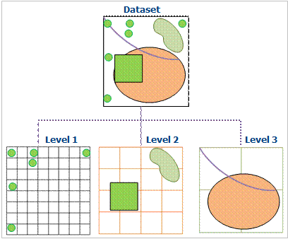

---
id: SpatialIndexMultiLevelGrid
title: Dynamic Spatial Index  
---  
### Principles

This multi-level grid index uses multi-level grids to organize and manage data. The basic method of the dynamic index is that it divides the dataset into equal size or unequal size grid, and records the locations of the grids which are occupied by the features. The regular grid is usually used in GIS. When performing spatial query, first the cells that contain the queried features will be calculated, then, the features will be queried rapidly. This multi-level grid index is used to optimize spatial query performance.

  
  
The spatial grid index has three grid levels, namely one, two, and three grid levels in current version, and each level has its own distinct cell size. The first grid level has the smallest cell size, and the data of 50% belongs to the first level. The second and third cell size must be larger than that of the preceding.

### Features

* The dynamic index will improve the speed when browsing the data.
* The ability to index updates and concurrency is good;
* The spatially search accuracy is high.

Note: this index type supports dynamic concurrency editing, supports database datasource.

### Available

Dynamic indexing is a new type of index provided by SuperMap 5.3. It combines the advantages of R tree index and quaternary tree index to provide a very good concurrent editing support. It has good universality, which is the default spatial index type.

If you cannot determine which spatial index is applied to the data, it is recommended to build a dynamic index.

###  Note

* The engine types which support for building a dynamic index include: SQLPlus and OraclePlus.
* After the establishment of a dynamic index, the user can make a local cache according to the map range, which can greatly improve the speed of query and browse, especially for the GB level data. For the data that is stored sheet by sheet, such as the national basic scale topographic map, the dynamic index can be set according to the size of the map sheet.

