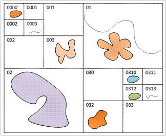
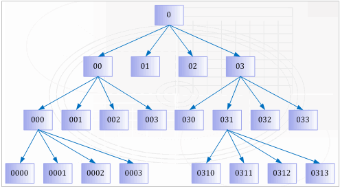

---
id: SpatialIndexQTree
title: Quadtree Spatial Index  
---  
### Principles

Quadtree index is an effective 2D spatial index, and its basic idea is: the entire working space is encoded to 0, with horizontal and vertical lines divided into four parts, which are encoded to 00, 01, 02 and 03 as the order, the upper left corner is 00, the lower right corner is 03; the same way to divide each grid, e.g., the grid 00 is divided into 000, 001, 002 and 003. According to the need, you can also continue to divide them. The dividing layers depend on the number and the average size of the objects in the research area.

  
  
If the object shown above is objects contained by the entire dataset, then its quadtree index structure is established as shown below:

  
  
### Available

It's for high concurrency editing of the data with small data volume.

###  Note

It supports the engine types: SQLPlus, OraclePlus, KingBase, MySQL, DB2 and GBase.