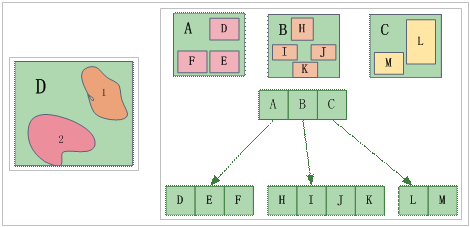

---
id: SpatialIndexRTree
title: R-tree Spatial Index  
---  
### Principles

R-tree is an index structure based on disk, which is an natural extension to the B-tree (one dimension) in the multi-dimension space. It is convenient to integrate the current database system, such as Oracle, SQL Server, etc, and it supports diversified spatial query operation. In fact, it has been widely used and is one of the most popular spatial indexes.

The R-tree spatial index defines several rectangles to contain geometric objects, that is, a rectangle contains some objects which have the close spatial locations. So the rectangle is regarded as the spatial index, which includes the pointers of the geometric objects.As shown in the figure, the rectangle named A includes the geometric objects such as D, E, F. The rectangle named B includes the geometric objects such as H, I, J and K. The rectangle named C includes the geometric object such as M, L. An example of R-tree spatial index displays as below.

  
  
If you perform the spatial index, you should first determine which rectangles are in the search window, then determine which geometric objects are in those rectangles. In this way, the query will be speed up.

### Features

* The spatial retrieval efficiency of R-tree index is very high, and the accuracy of the retrieval is also very high.
* R-tree index data and geographic data is not stored together, and the update of the R-tree index is related to its balance and split, so it's complex, and the update speed is slow, the query efficiency is reduced if many editing is done, it will be needed to rebuild the spatial index. R-tree index is suitable for the read-only data or the spatial data which doesn't be edited often.
* R-tree index supports file type datasource and database type datasource, the specific types can be seen in Table 1.

### Available

R-tree index is suitable for static data, e.g,, the base map data and the data which doesn't often need to be edited (except the attribute data editing) are recommended to establish the R-tree index.

###  Note

It supports the engine types: UDB, SQLPlus, PostgreSQL, OraclePlus, OracleSpatial, KingBase, MySQL, BeyonDB, GBase and Altibase.
