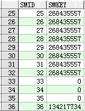
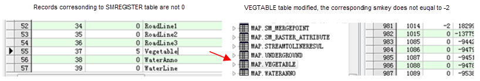
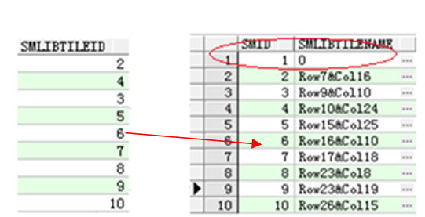

---
id: SpatialIndexStorage
title: Index Storage Sample  
---  
The following examples are based on the Oracle datasource, according to the 
index type to introduce the maintenance ways and the storage of spatial index, 
to facilitate advanced users to understand the structure of the index in the 
database.

### Quadtree index.

It's for high concurrency editing of the data with small data volume.

Maintenance: No related index table, if you build this index, only need to modify the SmKey value of the attribute table.

**Index Storage Sample:**

  
  
### R-tree spatial index.

R-tree index is suitable for static data, e.g,, the base map data and the data which doesn't often need to be edited (except the attribute data editing) are recommended to establish the R-tree index.

**Maintenance:**

    * The corresponding index table name: sm_idx_dataset table name, used to store the R-tree index data.
    * When you create the index and do not modify the objects in the dataset, its SmKey=-2.
    * SmIndexLevel in the registry table smregister is 0.
    * If you add or modify the records, the SmKey may be larger than-2 (determined by the R-tree index algorithm).
    * If there is a record whose SmKey is greater than -2, then its SmIndexLevel is 5 in the registry table smregister.

**Index Storage Sample:**

  
  
### Tile index

**Available:**

    * Field index: that is, according to the field to classify the objects, through the index to manage the classified spatial objects, in order to improve the query and retrieval speed.
    * Range index: that is, according to a specific range to classify the objects, through the index to manage the classified spatial objects, in order to improve the query and retrieval speed.

**Maintenance:**

    * Index table name: Lib_dataset table name.
    * The SmLibTileID value in the attribute table corresponds to SmID in the index table.
    * The row and column number of the SMLIBTILENAME field value(The row and column number (0,0) is calculated from the lower left corner of the dataset range.).
    * The SmLibTileID field in the dataset table and the SMID field in the index table is the relationship of 1 to N.
    * Data query process: first, get the current map window range; second, according to the sheet size in the range and tile index, determine which sheets will be displayed in the current view; third, in the corresponding index table (Lib_ dataset table name) to find the corresponding SMID values; fourth, find the objects to be displayed through the relationship between SMID and SmLibTileID. Through the above four steps, you can quickly locate the objects to be displayed.
    * For the newly added object, the object is added to the position where the SMID=1 in the index table if the object is outside the range of the original dataset.

**Index Storage Sample:**

   
  
### Dynamic index

Applicable scope: combines the advantages of R-tree index and quaternary tree
index, provides a very good concurrent editing support, and can be widly used.

**Maintenance:**

    * The corresponding index table name: SM_GDX_ dataset ID.
    * The SmDynamicIndex table records the dynamic index information of each dataset.

**Index Storage Sample:**

  

  
### Note

After the data is edited, the index will be automatically updated, but here in 
order not to affect the efficiency of display, it will not rebuild the index. 
Therefore, after a large number of editing operations, it is recommended to 
manually rebuild index, in order to achieve the index updating maintenance to 
ensure the query efficiency.

