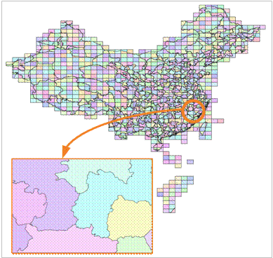

---
id: SpatialIndexTile
title: Tile Index  
---  
### Principles

In SuperMap SDX+, the spatial objects are classified according to one attribute field or a given range (sheet length and width). The spatial objects are managed by the index to improve the query speed. Following picture shows the map of the administrative boundaries of the Chinese municipal administrative boundaries, according to the given range to create the tile index, showing h4708. The tile index is very useful for the display and query of the vast amounts of data (i.e., the number of objects is more than one million). After the establishment of the index, it only shows what you need to see so as to greatly shorten the display time.

  
  
In particular, the tile index can also be cached to the local (in the form of binary file), so that it can further improve the speed of query and retrieval. File caching is an intelligent distributed storage scheme, which is provided by SuperMap SDX+ to balance the network and server load and improve the whole performance. After you open the file cache option, when the application is accessing data stored in the spatial database, it will firstly check whether the data exists in the local cache library, if there is no corresponding cache data or the cache data is not the latest version, it will read the data from the server and update the local cache data, so the next time it can read the local cache data. If the local cache has the latest version of the corresponding data, it does not need to use the network to access the server to request data, but directly read the local cache data to complete the display or analysis. Through this solution, the database server load and network load can be reduced greatly, and the whole performance of the application is greatly improved.

### Available

For the datasets stored in the database and with the standard scale(such as 1:25 million, 1:10 million, 1:5 million), it can provide a very good query performance after the tile index is built, with the provided caching option, it can achieve better map browsing speed.

###  Note

* The algorithm of building the tile index has made a substantial improvement in version 5.3. According to the data quantity, the index time consuming can be reduced 4-10 times. To build the tile index for the dataset whose records are more than 50000, it's recommended to use the version 5.3 and above.
* The tile index is currently only supported by the point, line, region, text and CAD data sets in the database datasource.
* It supports the engine types: SQLPlus, OraclePlus, KingBase, MySQL, GBase.
