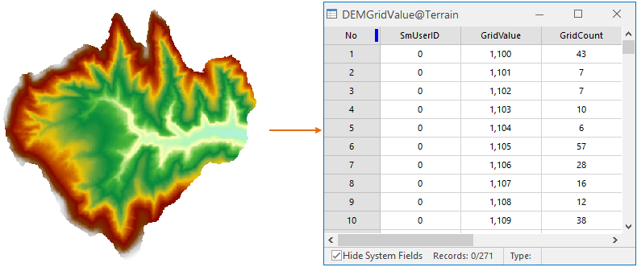

---
id: StatisticGridValue
title: Count Grid Value  
---  
### Introduction

The Count Grid Value command is used to count the grid values of the raster dataset. It is convenient for the user to view the specific single value distribution of the raster values.

Note: This command is only valid for raster datasets (ie Grid data). For image datasets (such as raster data in Image format), statistical raster values cannot be made, so there is not the option in their context menu.

Similar to the raster histogram, the function is applied to count the raster value. The difference is the statistical results. The result of raster histogram is to show the frequency distribution after grouping a certain field in the form of a grid interval. However the feature "Count Grid Value" is to count number of each unique raster value.

### Steps

1. Right-click on a raster dataset node (or more selected raster datasets) in the Workspace Manager and select the Count Grid Value command from the pop-up context menu.
2. If the operation is successful, the result which is a table will be popped up automatically. All unique values and number relative to each value are recorded in the table.
  
