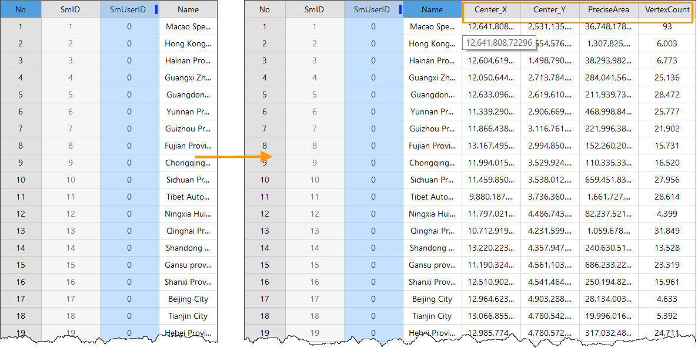
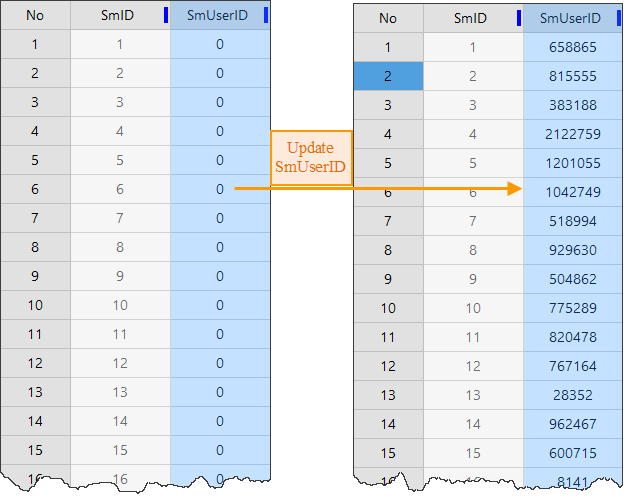

---
id: AddGeometryAttribute
title: Calculate Geometrical Attribute  
---  
iDesktop supports doing some maths on attributes of vector objects and saving to an attribute table.

### Calculate Attributes

Every vector object has some meta attributes like the coordinates of its center point, the number of its child objects, the perimeter of a geodesic line, and so on. Based on these meta attributes, iDesktop could do some calculations to get new attributes without any aid of other tools, which can enhance the efficiency of attribute processing. **Note** : This operation will change your source data. Please backup your data in advance.

This feature will add one or more fields to the corresponding attribute table.

**Function Entrances**

Open the attribute of your vector dataset. Click **Attribute Table** > **Editing** > **Add Geometry Attribute** and set **Select Mode** to **Add Geometry Attribute**.

**Parameter Description**

* **Geometry Attribute** : the geometry attribute depends on the type of the vector dataset type you select.
  * **Center Coordinates** : select this item to add two fields (Center_X and Center_Y) which record the coordinates of the center of each object to the attribute table.
  * **Centroid Coordinates** : select this item to add two fields (Inner_X and Inner_Y) which record the coordinates of the centroid of each object to the attribute table.
  * **Geodesic Area** : select this item to add the field PreciseArea which records the geodesic area of each polygon to the corresponding attribute table.
  * **Geodesic Perimeter** : select this item to add the field PrecisePerimeter which records the geodesic length of each line to the corresponding attribute table.
  * **Subobject Count** : select this item to add the field PartCount which records the number of the child objects of each object to the corresponding attribute table.
  * **Vertex Count** : select this item to add the field VertexCount which records the number of nodes of each object to the attribute table.
  * **Bound Coordinates** : select this item to add four fields (Left_User, Right_User, Top_User, and Bottom_User) which records the coordinates of the bounds of each object to the attribute table.
  * **Line Start Point** : select this item to add two fields (Start_X and Start_Y) which record the coordinates of the starting point of each line to the attribute table.
  * **Line Midpoint** : select this item to add two fields (Middle_X and Middle_Y) which record the coordinates of the center point of each line to the attribute table.
  * **Line End Point** : select this item to add two fields (End_X and End_Y) which record the coordinates of the ending point of each line to the attribute table.
* **Length/Area Unit** : the units of the resulting length and area. If your dataset has adopted a coordinate system, the two units are obtained based on the unit of the coordinate system you specified.
* **Coordinate** : The parameter determines the units of length and area. The coordinate system adopted in your vector dataset is by default.

**Instance** :

Given the attribute table of the Chinese provinces boundary dataset (a region dataset), we used the feature **Add Geometry Attribute** to calculate the coordinates of the center point of each polygon, geodesic area, and node count. And then we get the results shown in the following figure.

  

  
### Update Geometry Attribute

Updates the attributes of your vector dataset. It could not only update the value of a field of an object but also can assign a specific value like the geodesic length of a line to its normal field. **Note** : This operation will change your source data. Please backup your data in advance.

This feature would update the values of fields of your vector dataset according to the Geomerty Attribute you specified.

**Function Entrance**

Open the attribute of your vector dataset. Click **Attribute Table** > **Editing** > **Add Geometry Attribute** and set **Select Mode** to **Update Geometry Attribute**.

Select the field you want to update from the **Update Field** dropdown button. Other parameter settings are the same as the feature **Add Geometry Attribute**.

**Instance** :

We updated the values of the field SmUserID to the geodesic perimeters and obtained the results shown in the following picture.

  
